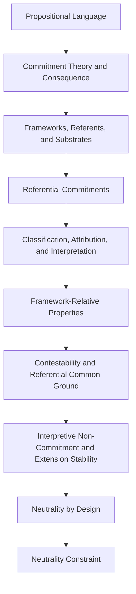

# SE Theory: Neutral Substrate

[](https://structural-explainability.github.io/se-theory-neutral-substrate/)
[](https://github.com/structural-explainability/se-theory-neutral-substrate)
[](./pyproject.toml)
[](./LICENSE)
[](https://doi.org/10.5281/zenodo.21694487)

[](https://github.com/structural-explainability/se-theory-neutral-substrate/actions/workflows/ci-lean.yml)
[](https://github.com/structural-explainability/se-theory-neutral-substrate/actions/workflows/ci-python-zensical.yml)
[](https://github.com/structural-explainability/se-theory-neutral-substrate/actions/workflows/deploy-zensical-lean.yml)
[](https://github.com/structural-explainability/se-theory-neutral-substrate/actions/workflows/links.yml)
[](https://github.com/structural-explainability/se-theory-neutral-substrate/security)

> Lean 4 formalization of the neutral structural substrate of
> Structural Explainability.

This repository defines the formal substrate conditions needed for
Structural Explainability theory.

## Authority

Lean source files are authoritative for formal definitions, predicates, axioms,
theorems, proof obligations, and reference rules.

Reference artifacts under `reference/` declare the repository-owned
classification, traceability, and export intent for the Lean public surface.

Generated artifacts under `data/neutral-substrate/` are outputs.
They do not define theory semantics independently of Lean or the reference artifacts.

The reusable `se-theory-reference-kit` owns the generic validation,
cataloging, inspection, and export machinery.
This repository owns its Lean source, reference declarations, and
generated neutral-substrate artifacts.

## Import

Import the public theory surface:

```lean
import SE.NeutralSubstrate
```

## Lean Module Convention

Production Lean code uses the `SE.*` namespace.

- `SE.lean` is the repository production entry point.
- `SE/<Project>.lean` is the project public import surface.
- Production modules live under `SE/<Project>/`.

Test Lean code uses the `SETest.*` namespace.

- `SETest.lean` is the repository test entry point.
- `SETest/<Project>.lean` is the project test surface.
- Test modules live under `SETest/<Project>/`.

`Spec.lean` is used when the project defines a specification module.

## Theory Structure



## Reference Configuration

The theory-reference workflow is configured by:

```text
reference/theory-reference.toml
```

That file declares this repository's Lean public modules,
reference artifact layout, export targets, and validation commands.
Public symbols are declared in the reference artifacts.

## Developer

Maintain:

- `lakefile.toml` and
- `lean-toolchain`
- `reference/theory-reference.toml` - hand-maintained configuration
- `reference/*.toml` - hand-maintained/scaffolded reference source artifacts
- Lean source + RR comments - hand-maintained theory source

### Clone and Open in VS Code

Open a machine terminal where you want the project
and open in VS Code:

```shell
git clone https://github.com/structural-explainability/se-theory-neutral-substrate

cd se-theory-neutral-substrate
code .
```

### Manage Python and Lean

Use VS Code Menu:
View / Command Palette / `Developer: Reload Window` to refresh.

```pwsh
.\sit.ps1
.\rel.ps1
```

```shell
# save progress
git add -A
git commit -m "update"
git push -u origin main
```

### Inspect Theory-Reference Commands

```shell
uv run se-theory-reference --help
uv run se-theory-reference inspect --help
uv run se-theory-reference export --help
uv run se-theory-reference catalog --help
uv run se-theory-reference validate --help
```

## Authority Manifest

[.accountability/surfaces.toml](./.accountability/surfaces.toml)

## Changelog

[CHANGELOG.md](./CHANGELOG.md)

## Citation

[CITATION.cff](./CITATION.cff)

## Documentation

[Documentation](https://structural-explainability.github.io/se-theory-neutral-substrate/)

## License

[MIT](./LICENSE)

## Repository Manifest

[SE_MANIFEST.toml](./SE_MANIFEST.toml)
