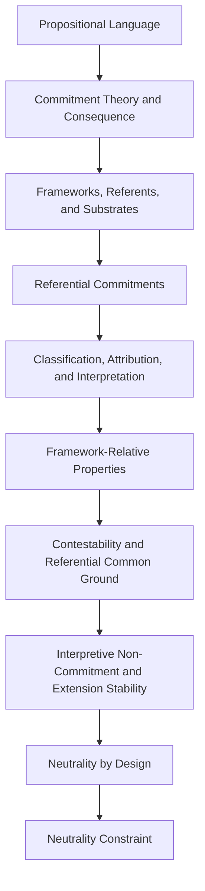

# SE Theory: Neutral Substrate

> Lean 4 formalization of the Neutral Substrate layer of
> Structural Explainability theory.

This repository formalizes the substrate conditions needed to remain compatible
with admissible interpretive frameworks without settling contested causal or
normative propositions at the foundational layer.

Lean source files under `SE/` are authoritative for formal definitions,
predicates, assumptions, theorems, and proof obligations.

- [Lean API Reference](https://structural-explainability.github.io/se-theory-neutral-substrate/lean/)
- [GitHub Repository](https://github.com/structural-explainability/se-theory-neutral-substrate)

## Neutral Substrate

The Neutral Substrate theory separates foundational commitments from
framework-relative interpretation.

The formalization distinguishes:

- propositions carried by a language
- commitments made by a substrate
- consequences of commitment theories
- admissible interpretive frameworks
- referential regimes and commitments
- causal and normative classification
- attributional and object-level propositions
- framework-relative variation and invariance
- interpretive non-commitment
- extension stability
- neutrality by design
- the neutrality constraint

Neutral Substrate theory defines foundational neutrality and admissibility
conditions. Relationships to Transformation Theory, Persistence Theory,
Identity Regimes, Operational Identity, and the Interpretive Kernel are
introduced only where later theory layers explicitly compose them.

## Theory Structure



## Covers

This repository covers:

- propositional-language foundations
- commitment theories and theory extension
- consequence systems and consistency
- interpretive framework systems
- admissible framework classes
- referent carriers
- referential regimes
- substrate systems and commitments
- referential commitments
- causal and normative classification
- attribution propositions
- permitted attribution
- object-level interpretive propositions
- object-level causal or normative commitments
- framework-variant propositions
- framework-invariant propositions
- framework-compatible commitment sets
- contested causal or normative propositions
- design-time guarantees
- contestability
- referential common ground
- substrate consistency
- interpretive non-commitment
- extension stability
- neutrality by design
- the neutrality constraint
- Lean-side citation identifiers
- machine-readable reference artifacts
- the public Lean import surface

## Owns

This repository owns:

- the public import surface `SE/NeutralSubstrate.lean`
- the repository-level aggregator `SE.lean`
- foundational Lean modules under `SE/Logic/`
- framework modules under `SE/Framework/`
- referent modules under `SE/Referent/`
- substrate modules under `SE/Substrate/`
- Neutral Substrate theory under `SE/NeutralSubstrate/`
- Lean tests under `SETest/`
- stable citation identifiers in `SE/NeutralSubstrate/Spec.lean`
- reference declarations under `reference/`
- generated artifacts under `data/neutral-substrate/`
- machine-checked Neutral Substrate theorems

## Out of Scope

Those concerns belong to downstream Structural Explainability repositories:

- transformation theory
- persistence theory
- mapping semantics
- domain-specific scheduling semantics
- runtime validation
- runtime systems
- operational policy

## Authority

Lean source files are authoritative for:

- formal definitions
- predicates
- assumptions
- theorems
- proof obligations
- public theorem interfaces

Reference artifacts under `reference/` declare repository-owned classification,
traceability, citation mapping, and export intent for the Lean public surface.

Generated artifacts under `data/neutral-substrate/` are outputs.
They do not define theory semantics independently of Lean or the reference declarations.

The reusable `se-theory-reference-kit` owns generic reference validation,
scaffolding, cataloging, inspection, and export machinery.

## Documentation

Documentation is descriptive only and may provide:

- orientation
- explanatory summaries
- structural descriptions
- navigation
- non-authoritative theorem descriptions

It must not:

- introduce formal semantics absent from Lean
- redefine Lean predicates in incompatible terms
- introduce undeclared terminology
- encode additional rules or invariants
- diverge from Lean module naming

Exact declaration signatures and source documentation are available in the
[Lean API Reference](https://structural-explainability.github.io/se-theory-neutral-substrate/lean/).

## Import

Downstream Lean projects should import the public surface:

```lean
import SE.NeutralSubstrate
```

## Tooling

Python and other tooling may be used for:

- documentation generation
- formatting and linting
- repository automation
- reference artifact validation
- generated contract export checks

They must not:

- define correctness
- validate theory semantics independently of Lean
- replace Lean definitions or proofs
- introduce downstream theory dependencies
