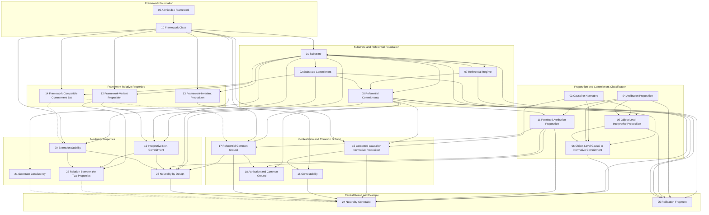
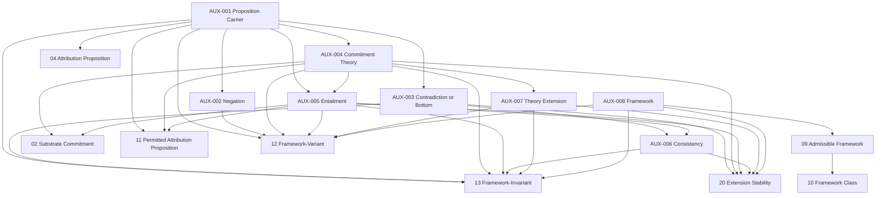

# Lean Formalization Audit

> One-time review; information may be superseded.
> Kept to record decisions and process only.

## Authoritative Basis

- Paper: SE-100 Neutral Substrates
- Basis URL: <https://raw.githubusercontent.com/structural-explainability/paper-100-neutral-substrate/refs/heads/main/se100-lean-basis.md>
- Paper repository commit: 27d002da359632a8fe73869a1b2a9c6b0d9d6527
- Basis SHA-256: B07A892B5198CC5A195A100B7BC7322241238D516426511BC65FFE19D667FF69
- Retrieved: 2026-07-29T10:59:49Z
- Labeled paper items: 25

## Exactness Rule

The paper basis is authoritative.
Each labeled paper item must have:

- an exact canonical Lean representation;
- an exact representation through a proved encoding; or
- an explicit unresolved audit verdict.

No Lean implementation convenience may silently weaken, strengthen,
specialize, or replace the paper statement.

## Audit Verdicts

Each completed record receives one verdict:

- Exact
- Exact via proved encoding
- Stronger than paper
- Weaker than paper
- Special case only
- Executable refinement only
- Missing
- Misclassified
- Terminology mismatch
- Dependency mismatch
- Boundary condition missing
- Unresolved

## Auxiliary Formal Infrastructure

These records identify infrastructure needed to state and prove the paper in Lean.
They are not additional paper contributions.
The paper determines the required mathematical role.
The Lean representation remains unresolved until the candidate encoding has been compared with the complete paper basis, the required proofs, Lean Core, and the pinned Mathlib version.

| Auxiliary item                   | Requirement supported by the paper                                                                   | Candidate Lean representation                                                            | Status     |
| -------------------------------- | ---------------------------------------------------------------------------------------------------- | ---------------------------------------------------------------------------------------- | ---------- |
| `AUX-001 Proposition Carrier`    | Propositions occur as objects of entailment, attribution, classification, and negation.              | Abstract carrier such as `P : Type u`.                                                   | Unresolved |
| `AUX-002 Negation`               | If `p` is a proposition, `¬p` is also used as an object of entailment.                               | Operation such as `neg : P → P`.                                                         | Unresolved |
| `AUX-003 Contradiction / Bottom` | Consistency is expressed through non-entailment of `⊥`.                                              | Distinguished proposition such as `bottom : P`.                                          | Unresolved |
| `AUX-004 Commitment Theory`      | Substrates, frameworks, and commitment sets contribute collections of commitments combined by union. | `Set P` or another extensionally equivalent carrier.                                     | Unresolved |
| `AUX-005 Entailment`             | The paper uses an abstract relation `T ⊢ p` and reasons structurally about it.                       | Local abstract relation with only the laws required by the paper.                        | Unresolved |
| `AUX-006 Consistency`            | The paper writes consistency as `T ⊬ ⊥`.                                                             | Derived predicate `¬ entails T bottom`.                                                  | Unresolved |
| `AUX-007 Theory Extension`       | The paper combines commitment-bearing objects using expressions such as `S ∪ F`.                     | Set union or a transparent operation on commitment projections.                          | Unresolved |
| `AUX-008 Framework`              | Frameworks contribute commitments and are assessed for intrinsic admissibility.                      | Local carrier or structure with commitment and admissibility-related data or predicates. | Unresolved |

## Confirmed Reusable Lean Infrastructure

The following are general Lean or Mathlib facilities that are likely relevant, subject to confirmation against the pinned version:

```text
types
functions
predicates
binary relations
logical quantifiers and connectives
set membership
set inclusion
set union
singleton sets
insertion
```

This list does not yet determine the canonical representation of any Paper 100 concept.

## Paper-Derived Requirements

The paper requires the formalization to represent:

```text
propositions as objects of commitment and attribution
object-language negation
object-language contradiction
commitment-bearing collections
entailment
consistency
theory combination
frameworks
substrates
the 25 labeled paper items
```

These are requirements extracted from the paper.

## Candidate-Representation Rule

A proposed Lean representation remains `Unresolved` until the audit establishes that it:

- states every relevant paper definition exactly;
- supports every paper proof with no hidden logical assumptions;
- introduces no unjustified finiteness, decidability, closure, or logical-strength assumptions;
- preserves every distinction made by the paper; and
- is not duplicating a suitable Lean Core or Mathlib abstraction.

Only then may the record receive either:

- `Exact`; or
- `Exact via proved encoding`.

### AUX-001 — Proposition Carrier

- Auxiliary ID: AUX-001
- Name: Proposition Carrier
- Needed by paper items:
  - se100.def.SubstrateCommitment
  - se100.note.CausalNormative
  - se100.def.AttributionProposition
  - se100.def.ObjectLevelInterpretiveProposition
  - se100.def.FrameworkVariant
  - se100.def.FrameworkInvariant
  - se100.def.ContestedCausalNormative
  - se100.def.InterpretiveNonCommitment
- Mathematical role:
  - Carrier of object-language propositions about which substrates and
    frameworks make commitments.
  - Propositions must be usable as data inside attribution propositions.
- Required carrier:
  - An abstract type in an arbitrary universe.
- Required operations:
  - None at this record; negation and contradiction are audited separately.
- Required laws:
  - None at this record.
- Lean Core candidates:
  - Type u
  - Prop
- Mathlib candidates:
  - FirstOrder.Language.Formula
  - FirstOrder.Language.Sentence
- CSLib candidates:
  - None presently required.
- Reuse decision:
  - Use an abstract Type u parameter.
  - Do not use Lean Prop because propositions must be represented as
    object-language data.
  - Do not use Mathlib first-order formulas because Paper 100 does not fix
    a first-order object logic.
- Additional assumptions introduced:
  - None.
- Proposed module:
  - SE/NeutralSubstrate/Foundation/Proposition.lean
- Proposed declaration:
  - Not yet fixed; likely a carrier field or type parameter rather than a
    concrete inductive type.
- Proposed signature:
  - Proposition : Type u
- Exactness justification:
  - The representation preserves the paper’s abstraction over propositions
    without imposing syntax, semantics, decidability, finiteness, or a
    particular logical calculus.
- Proof obligations:
  - None for the bare carrier.
- Test obligations:
  - Later attribution tests must distinguish Asserts x φ from φ.
- Audit verdict: Exact
- Status: Candidate reviewed; declaration shape not yet frozen.

### AUX-002 — Negation

- Auxiliary ID: AUX-002
- Name: Negation
- Needed by paper items:
  - `se100.def.FrameworkVariant`
  - `se100.def.InterpretiveNonCommitment`
  - `se100.remark.PropertyRelation`
  - indirectly, every later item that depends on interpretive non-commitment

- Mathematical role:
  - Represents object-language negation.
  - Given an object-language proposition `p`, produces the object-language proposition written `¬p` in the paper.
  - Allows both `p` and its negation to occur as objects of substrate or framework entailment.
  - Must remain distinct from Lean’s meta-level negation of a proposition-valued statement.

- Required carrier:
  - The abstract proposition carrier established by `AUX-001`.
  - If that carrier is written `P : Type u`, negation operates on `P`.

- Required operations:
  - A unary operation:

    ```lean
    neg : P → P
    ```

- Required laws:
  - No algebraic law is required merely to state the Paper 100 definitions.
  - In particular, Paper 100 does not require the audit to assume:
    - involution, `neg (neg p) = p`;
    - decidability;
    - excluded middle;
    - De Morgan laws;
    - Boolean complementation; or
    - that every proposition is distinct from its negation.

  - The later proof that deriving both `p` and `neg p` yields contradiction is a law of the consequence system, not a law of the negation operation.

- Lean Core candidates:
  - `Not : Prop → Prop`
    - Rejected as the canonical representation.
    - `Not` is Lean’s meta-level negation and applies only to Lean propositions.
    - Paper 100 requires negated propositions to remain object-language data that can occur inside theories and entailment judgments.

- Mathlib candidates:
  - Syntax-level negation operations on particular formula languages.
  - Rejected as the canonical representation because they would specialize Paper 100 to a particular object logic or formula syntax not fixed by the paper.
  - No generic Mathlib negation structure should be adopted unless it matches the abstract carrier without introducing additional logical laws.

- CSLib candidates:
  - None presently required.
  - A CSLib formula or semantics type would be considered only if a later exact audit showed that Paper 100 requires that specific logical structure.

- Reuse decision:
  - Define negation locally as an abstract unary operation on the proposition carrier.
  - Likely bundle it with the proposition carrier, contradiction proposition, and entailment relation in the shared logical foundation.
  - Do not represent object-language negation using Lean’s `Not`.

- Additional assumptions introduced:
  - None.
  - The operation is initially uninterpreted except through the consequence-system laws explicitly required by Paper 100.

- Proposed module:
  - `SE/NeutralSubstrate/Foundation/ConsequenceSystem.lean`
  - Final module name remains pending completion of `AUX-001` through `AUX-007`.

- Proposed declaration:
  - Likely a field named `neg` in the abstract consequence-system structure.

- Proposed signature:

  ```lean
  neg : Proposition → Proposition
  ```

  or, before bundling:

  ```lean
  variable {P : Type u}
  variable (neg : P → P)
  ```

- Exactness justification:
  - The paper uses `p` and `¬p` as propositions within the same object language.
  - Both may occur on the right side of the entailment relation.
  - An abstract unary operation preserves this meaning without imposing a syntax, proof calculus, semantics, decidability condition, or classical logic.

- Proof obligations:
  - No proof obligation for the bare operation.
  - Under `AUX-005 — Entailment`, identify the exact law needed to infer contradiction when a theory entails both `p` and `neg p`.
  - Do not prove or assume involutivity unless a paper statement or later paper dependency requires it.

- Test obligations:
  - Demonstrate that both `p` and `neg p` are valid members of the object-language proposition carrier.
  - Demonstrate that `entails T (neg p)` is well-typed independently of the Lean proposition `¬ entails T p`.
  - Include a type-level test preventing accidental identification of object-language negation with Lean `Not`.

- Audit verdict: Unresolved
- Status: Candidate completed; pending review of the full logical-foundation cluster.
- Reviewer notes:
  - Preserve the distinction:

    ```lean
    entails T (neg p)
    ```

    means that `T` entails the object-language negation of `p`, whereas:

    ```lean
    ¬ entails T p
    ```

    means, at Lean’s meta-level, that `T` does not entail `p`.

  - These statements are not equivalent and must never be conflated.

### AUX-003 — Contradiction / Bottom

- Auxiliary ID: AUX-003
- Name: Contradiction / Bottom
- Needed by paper items:
  - `se100.def.AdmissibleFramework`
  - `se100.def.FrameworkInvariant`
  - `se100.def.FrameworkCompatibleCommitmentSet`
  - `se100.assump.ReferentialCommonGround`
  - `se100.def.ExtensionStability`
  - `se100.assump.SubstrateConsistency`
  - `se100.remark.AttributionCommonGround`
  - `se100.remark.PropertyRelation`
  - indirectly, `se100.def.NeutralityByDesign`
  - indirectly, `se100.constraint.Neutrality`

- Mathematical role:
  - Represents the distinguished object-language contradiction proposition written `⊥` in the paper.
  - Serves as the proposition whose entailment marks a commitment theory or theory extension as inconsistent.
  - Allows the paper’s consistency statements to be represented uniformly as non-entailment of contradiction.

- Required carrier:
  - The abstract proposition carrier established by `AUX-001`.
  - If that carrier is written `P : Type u`, contradiction is an element of `P`.

- Required operations:
  - A distinguished object-language proposition:

    ```lean
    bottom : P
    ```

- Required laws:
  - No independent algebraic law is required merely to introduce the contradiction proposition.
  - The following must not be assumed as properties of `bottom`:
    - explosion;
    - proof irrelevance;
    - decidability;
    - uniqueness of contradiction;
    - order-theoretic leastness;
    - Boolean-algebra laws; or
    - identification with Lean’s `False`.

  - The later inference from entailment of both `p` and `neg p` to entailment of `bottom` belongs to the consequence-system laws audited under `AUX-005 — Entailment`.
  - The paper uses `T ⊬ ⊥` as the form of consistency; this relationship is audited under `AUX-006 — Consistency`.

- Lean Core candidates:
  - `False : Prop`
    - Rejected as the canonical representation.
    - `False` is Lean’s meta-level false proposition.
    - Paper 100 requires contradiction to occur as an object-language proposition on the right side of the abstract entailment relation.

  - `False.elim`
    - Not relevant to the carrier representation.
    - It expresses meta-level elimination from a proof of `False`, not object-language entailment of contradiction.

- Mathlib candidates:
  - `⊥` supplied through order-theoretic `Bot` or `OrderBot` structures.
    - Not adopted at this stage.
    - Using an order-theoretic bottom would introduce an ordering structure on the proposition carrier that Paper 100 does not state or require.

  - Bottom formulas supplied by particular formal-language libraries.
    - Rejected as canonical because they would specialize Paper 100 to a particular syntax or object logic.

- CSLib candidates:
  - None presently required.
  - A contradiction constructor from a specific logic or language would be unsuitable unless a later audit establishes that Paper 100 requires that logic.

- Reuse decision:
  - Define contradiction locally as a distinguished element of the abstract proposition carrier.
  - Likely bundle it with object-language negation and entailment in the shared consequence-system foundation.
  - Do not identify it with Lean’s `False`.
  - Do not introduce `Bot P` or `OrderBot P` unless later evidence shows that order-theoretic notation provides value without adding unintended semantics.

- Additional assumptions introduced:
  - None.
  - The distinguished element is initially uninterpreted except through the entailment and consistency laws explicitly required by the paper.

- Proposed module:
  - `SE/NeutralSubstrate/Foundation/ConsequenceSystem.lean`
  - Final module placement remains pending completion of `AUX-001` through `AUX-007`.

- Proposed declaration:
  - Likely a field named `bottom` in the abstract consequence-system structure.

- Proposed signature:

  ```lean
  bottom : Proposition
  ```

  or, before bundling:

  ```lean
  variable {P : Type u}
  variable (bottom : P)
  ```

- Exactness justification:
  - Paper 100 repeatedly places `⊥` on the right side of the same entailment relation used for ordinary propositions:

    ```text
    T ⊢ ⊥
    ```

  - Therefore, `⊥` must inhabit the same object-language proposition carrier as `p` and `neg p`.
  - A distinguished carrier element preserves the paper abstract treatment without imposing a syntax, semantics, proof calculus, lattice structure, or classical logic.

- Proof obligations:
  - No proof obligation for the bare distinguished proposition.
  - Under `AUX-005 — Entailment`, identify and state the law required to derive:

    ```lean
    entails T p →
    entails T (neg p) →
    entails T bottom
    ```

  - Under `AUX-006 — Consistency`, verify that every paper use of consistency is represented exactly as:

    ```lean
    ¬ entails T bottom
    ```

  - Confirm that no Paper 100 proof requires explosion from `entails T bottom`.

- Test obligations:
  - Demonstrate that `bottom` is a valid object-language proposition and can occur in:

    ```lean
    entails T bottom
    ```

  - Demonstrate that:

    ```lean
    entails T bottom
    ```

    is distinct from Lean’s meta-level `False`.

  - Demonstrate that:

    ```lean
    ¬ entails T bottom
    ```

    is a well-typed meta-level consistency statement.

  - Include a type-level test preventing accidental substitution of `False` for the object-language contradiction proposition.

- Audit verdict: Unresolved
- Status: Candidate completed; pending review of the full logical-foundation cluster.
- Reviewer notes:
  - Preserve the distinction:

    ```lean
    entails T bottom
    ```

    means that `T` entails the object-language contradiction proposition, whereas:

    ```lean
    False
    ```

    is Lean’s meta-level false proposition.

  - Paper 100 does not state that the proposition carrier is ordered, so use of order-theoretic `⊥` notation should not be allowed to introduce an unneeded `Bot` or `OrderBot` assumption.
  - The contradiction rule connecting `p`, `neg p`, and `bottom` must be recorded under entailment rather than hidden in this declaration.

### AUX-004 — Commitment Theory

- Auxiliary ID: AUX-004
- Name: Commitment Theory
- Needed by paper items:
  - `se100.def.Substrate`
  - `se100.def.SubstrateCommitment`
  - `se100.def.ReferentialCommitments`
  - `se100.def.FrameworkVariant`
  - `se100.def.FrameworkInvariant`
  - `se100.def.FrameworkCompatibleCommitmentSet`
  - `se100.assump.ReferentialCommonGround`
  - `se100.def.InterpretiveNonCommitment`
  - `se100.def.ExtensionStability`
  - `se100.assump.SubstrateConsistency`
  - `se100.remark.AttributionCommonGround`
  - `se100.remark.PropertyRelation`
  - `se100.def.NeutralityByDesign`
  - `se100.constraint.Neutrality`

- Mathematical role:
  - Represents an arbitrary collection of object-language propositions treated as commitments.
  - Provides the carrier on the left side of the paper’s entailment relation:

    ```text
    T ⊢ p
    ```

  - Provides the set-theoretic interpretation of commitment collections such as:
    - substrate commitments;
    - framework commitments;
    - referential commitments;
    - a framework-compatible commitment set;
    - a singleton commitment `{p}`; and
    - unions of those collections.

  - Does not by itself identify a commitment collection as a substrate, framework, or referential regime.

- Required carrier:
  - An arbitrary set of elements from the abstract proposition carrier established by `AUX-001`.
  - If the proposition carrier is written `P : Type u`, the commitment-theory carrier is:

    ```lean
    Set P
    ```

- Required operations:
  - Membership:

    ```lean
    p ∈ T
    ```

  - Empty commitment theory:

    ```lean
    ∅
    ```

  - Singleton commitment theory:

    ```lean
    {p}
    ```

  - Union:

    ```lean
    T₁ ∪ T₂
    ```

  - Subset:

    ```lean
    T₁ ⊆ T₂
    ```

  - Insertion may be useful as the computational form of singleton extension:

    ```lean
    insert p T
    ```

  - Extensional equality of commitment theories.

- Required laws:
  - Ordinary set extensionality.
  - Ordinary membership laws for empty sets, singletons, insertion, and union.
  - Associativity of union.
  - Commutativity of union where rearrangement is required.
  - Idempotence of union.
  - Subset laws required to express inclusion of a theory in an extension.
  - No logical closure property is imposed on a commitment theory merely because it is called a theory.
  - In particular, the carrier is not required to contain every proposition it entails.
  - Monotonicity of entailment under theory inclusion belongs to `AUX-005 — Entailment`, not to the set carrier.

- Lean Core candidates:
  - Predicate representation:

    ```lean
    P → Prop
    ```

  - This is extensionally the representation underlying Lean sets, but direct use would forgo the standard set notation and supporting library.

- Mathlib candidates:
  - `Set P`
  - Standard set membership, union, singleton, insertion, subset, and extensionality.
  - `Finset P`
    - Rejected as the canonical representation.
    - It would introduce finiteness and generally require decidable equality for computational operations.

  - `Multiset P`
    - Rejected.
    - The paper does not attach multiplicity or ordering significance to repeated commitments.

  - `List P`
    - Rejected.
    - The paper does not treat commitment order or duplicate occurrence as semantically relevant.

- CSLib candidates:
  - None presently required.
  - Commitment collections use ordinary mathematical set structure rather than computer-science-specific infrastructure.

- Reuse decision:
  - Reuse Mathlib’s `Set`.
  - Introduce, at most, a transparent paper-local abbreviation:

    ```lean
    abbrev CommitmentTheory (P : Type u) := Set P
    ```

  - Do not define a new set implementation.
  - Do not use `Finset`, `List`, or `Multiset` as the canonical semantic carrier.
  - Do not yet identify `Substrate` or `Framework` definitionally with `CommitmentTheory`.
  - A substrate or framework may become a richer structure that exposes a commitment theory through a field or projection.

- Additional assumptions introduced:
  - None.
  - In particular, this representation introduces no:
    - finiteness assumption;
    - decidable-equality assumption;
    - enumeration;
    - ordering;
    - multiplicity;
    - logical closure condition; or
    - commitment-completeness condition.

- Proposed module:
  - `SE/NeutralSubstrate/Foundation/Theory.lean`
  - This may later be folded into `Foundation/ConsequenceSystem.lean` if the complete `AUX-001` through `AUX-007` audit shows that a single bundled foundation is clearer.

- Proposed declaration:
  - `CommitmentTheory`

- Proposed signature:

  ```lean
  abbrev CommitmentTheory (P : Type u) := Set P
  ```

  Alternatively, the implementation may use `Set P` directly if the abbreviation provides no meaningful readability or provenance benefit.

- Exactness justification:
  - Paper 100 treats substrate-layer commitments and framework commitments extensionally as collections of propositions.
  - It uses ordinary set notation for union and singleton extension:

    ```text
    S ∪ F
    S ∪ F ∪ {p}
    C ∪ F
    ```

  - An arbitrary `Set P` represents these collections without imposing finiteness, ordering, multiplicity, decidability, or a concrete logical syntax.
  - Keeping the commitment theory distinct from the eventual `Substrate` and `Framework` structures prevents the set representation from erasing the paper’s additional referential, evidentiary, and documentary structure.

- Proof obligations:
  - Verify that each use of union in Paper 100 corresponds to union of the relevant commitment theories.
  - If `Substrate` and `Framework` become structures, define their commitment projections explicitly.
  - Establish that the notation or helper used for:

    ```lean
    substrate commitments ∪ framework commitments
    ```

    is definitionally equal to or proved equivalent to ordinary set union.

  - Verify that no Paper 100 statement requires commitment theories to be finite.
  - Verify that no Paper 100 statement requires commitment theories to be deductively closed.
  - Under `AUX-005 — Entailment`, state monotonicity with respect to ordinary set inclusion.

- Test obligations:
  - Demonstrate membership in an arbitrary commitment theory.
  - Demonstrate:

    ```lean
    p ∈ ({p} : CommitmentTheory P)
    ```

  - Demonstrate the expected membership characterization:

    ```lean
    p ∈ T₁ ∪ T₂ ↔ p ∈ T₁ ∨ p ∈ T₂
    ```

  - Demonstrate that union is insensitive to order and duplicate inclusion.
  - Demonstrate that an infinite `Set P` is permitted by the semantic carrier.
  - If `Substrate` and `Framework` become structures, test that their union operation combines commitment projections without discarding their separate metadata.

- Audit verdict: Unresolved
- Status: Candidate completed; pending the `Substrate` and `Framework` representation audits.
- Reviewer notes:
  - `CommitmentTheory` is auxiliary vocabulary for the formalization. It is not a new Paper 100 concept.
  - The word “theory” must not imply deductive closure unless such closure is separately stated and proved.
  - The paper’s notation may present `S` and `F` directly as set-like objects, but Lean should not use coercions or abbreviations that erase fields required by `se100.def.Substrate` or `se100.def.AdmissibleFramework`.
  - Preserve the distinction between:

    ```lean
    p ∈ T
    ```

    meaning that `p` is explicitly present in a commitment collection, and:

    ```lean
    entails T p
    ```

    meaning that `p` follows from that collection.

  - Paper 100 defines substrate-layer commitment through entailment, not through set membership.

### AUX-005 — Entailment

- Auxiliary ID: AUX-005
- Name: Entailment
- Needed by paper items:
  - `se100.def.SubstrateCommitment`
  - `se100.def.AdmissibleFramework`
  - `se100.def.PermittedAttributionProposition`
  - `se100.def.FrameworkVariant`
  - `se100.def.FrameworkInvariant`
  - `se100.def.FrameworkCompatibleCommitmentSet`
  - `se100.assump.ReferentialCommonGround`
  - `se100.remark.AttributionCommonGround`
  - `se100.def.InterpretiveNonCommitment`
  - `se100.def.ExtensionStability`
  - `se100.assump.SubstrateConsistency`
  - `se100.remark.PropertyRelation`
  - `se100.def.NeutralityByDesign`
  - `se100.constraint.Neutrality`

- Mathematical role:
  - Represents the paper’s abstract object-language consequence relation:

    ```text
    T ⊢ p
    ```

  - Relates a commitment theory `T` to an object-language proposition `p`.
  - Determines when a substrate, framework, referential commitment set, or combined theory commits to or derives a proposition.
  - Supports the paper’s distinction between:

    ```text
    T ⊢ p
    ```

    and:

    ```text
    p ∈ T
    ```

  - Remains abstract over the particular syntax, proof calculus, semantics, or model theory used to determine consequence.

- Required carrier:
  - A commitment theory from `AUX-004`, provisionally:

    ```lean
    CommitmentTheory P
    ```

    where `P : Type u` is the proposition carrier from `AUX-001`.

  - An object-language proposition from `P`.
  - A meta-level Lean proposition as the result.

- Required operations:
  - A binary relation:

    ```lean
    entails : CommitmentTheory P → P → Prop
    ```

  - The formalization may introduce notation only after the declaration is stable:

    ```lean
    T ⊢ p
    ```

- Required laws:
  - The bare Paper 100 definitions require only the relation.

  - The paper’s explicit arguments appear to require the following structural laws.

  - **Assumption or reflexivity**

    ```lean
    p ∈ T → entails T p
    ```

    A proposition explicitly included in a commitment theory is available as a consequence of that theory.

  - **Monotonicity or weakening**

    ```lean
    T ⊆ U →
    entails T p →
    entails U p
    ```

    Extending a commitment theory does not remove an existing consequence.

    This law is used in the paper’s argument that if:

    ```text
    S ⊢ p
    ```

    then:

    ```text
    S ∪ F ⊢ p.
    ```

  - **Cut or consequence absorption**

    ```lean
    entails T p →
    entails (insert p T) q →
    entails T q
    ```

    Adjoining a proposition already entailed by a theory adds no independent consequence.

    Together with monotonicity, this supports the paper’s claim that if:

    ```text
    Sref ⊢ Asserts(x, φ)
    ```

    then adding that permitted attribution proposition does not change whether the combined theory entails contradiction.

  - **Contradiction formation**

    ```lean
    entails T p →
    entails T (neg p) →
    entails T bottom
    ```

    A theory that entails both a proposition and its object-language negation entails the distinguished contradiction proposition.

    This law is used explicitly in the paper’s proof that extension stability entails interpretive non-commitment.

  - The exact final law set remains unresolved until every Paper 100 proof is audited.

  - The following must not be added unless a paper proof requires them:
    - decidability of entailment;
    - compactness;
    - completeness;
    - semantic soundness relative to a model class;
    - finitarity;
    - substitution;
    - a deduction theorem;
    - explosion from contradiction;
    - excluded middle;
    - double-negation elimination;
    - contraposition;
    - proof irrelevance;
    - Boolean completeness; or
    - deductive closure represented as set membership.

- Lean Core candidates:
  - An ordinary Lean relation:

    ```lean
    CommitmentTheory P → P → Prop
    ```

  - Lean’s meta-level implication and universal quantification can state the required structural laws.
  - Lean Core does not determine the intended object-language consequence relation.

- Mathlib candidates:
  - General relation infrastructure.
  - Set inclusion and set operations used by the structural laws.
  - Concrete entailment relations for particular logical languages or semantic systems.
  - No Mathlib candidate should be adopted until its exact type and assumptions are checked against the pinned Mathlib version.
  - A concrete first-order, propositional, modal, or semantic consequence relation would be too specialized unless Paper 100 is explicitly revised to adopt that logic.

- CSLib candidates:
  - Possible consequence or semantics infrastructure associated with particular formal languages.
  - No CSLib dependency is presently justified.
  - CSLib should be consulted only if it provides a stable, genuinely logic-neutral consequence structure matching the required signature and laws exactly.

- Reuse decision:
  - Define an abstract consequence relation locally.
  - Reuse Lean and Mathlib only for:
    - `Set`;
    - set inclusion;
    - union;
    - insertion;
    - singleton sets;
    - predicates;
    - relations; and
    - ordinary logical reasoning.

  - Do not select a concrete object logic.
  - Likely bundle entailment with the proposition carrier, object-language negation, contradiction proposition, and precisely the structural laws required by Paper 100.

- Additional assumptions introduced:
  - The relation introduces no assumption about which propositions follow from which theories.
  - Each structural law added to the consequence system is an additional logical assumption and must be justified by an identified Paper 100 argument.
  - The current candidate laws are:
    - assumption/reflexivity;
    - monotonicity;
    - cut/consequence absorption; and
    - contradiction formation.

  - Their independence and exact necessity remain to be audited.

- Proposed module:
  - `SE/NeutralSubstrate/Foundation/ConsequenceSystem.lean`

- Proposed declaration:
  - Likely a structure named:

    ```lean
    ConsequenceSystem
    ```

  - The name remains provisional until `AUX-001` through `AUX-007` are reviewed together.

- Proposed signature:

  ```lean
  structure ConsequenceSystem where
    Proposition : Type u
    neg : Proposition → Proposition
    bottom : Proposition
    entails : Set Proposition → Proposition → Prop

    assumption :
      ∀ {T p}, p ∈ T → entails T p

    monotone :
      ∀ {T U p}, T ⊆ U → entails T p → entails U p

    cut :
      ∀ {T p q},
        entails T p →
        entails (insert p T) q →
        entails T q

    contradiction :
      ∀ {T p},
        entails T p →
        entails T (neg p) →
        entails T bottom
  ```

  Alternatively, the carrier may remain an external type parameter:

  ```lean
  structure ConsequenceSystem (P : Type u) where
    neg : P → P
    bottom : P
    entails : Set P → P → Prop
    ...
  ```

  The bundled-versus-parameterized choice remains unresolved.

- Exactness justification:
  - Paper 100 uses entailment abstractly and does not specify a concrete object logic.
  - An abstract relation preserves that generality.
  - The candidate structural laws correspond to reasoning explicitly used by the paper:
    - consequences survive extension;
    - explicitly included commitments are available;
    - adjoining an already entailed attribution adds no independent consequence; and
    - deriving both sides of a proposition yields contradiction.

  - No stronger logical calculus is imposed.

- Proof obligations:
  - Identify every use of entailment reasoning in all 25 basis items.
  - For each reasoning step, map it to one explicit structural law.
  - Confirm that monotonicity is sufficient for every passage from:

    ```text
    T ⊢ p
    ```

    to:

    ```text
    T ∪ U ⊢ p.
    ```

  - Confirm that cut is sufficient for the equivalence in `se100.remark.AttributionCommonGround`.
  - Confirm that contradiction formation is sufficient for `se100.remark.PropertyRelation`.
  - Determine whether assumption/reflexivity is required by the main neutrality constraint or only by the chosen representation of foundational-layer membership.
  - Determine whether any proof requires transitivity in a form stronger than the proposed cut law.
  - Determine whether any proof requires explosion from `bottom`; the current paper basis does not appear to use it.
  - Prove characterization lemmas for any notation or wrappers introduced around `entails`.

- Test obligations:
  - Construct a small abstract or concrete consequence system satisfying the agreed laws.
  - Test the distinction between:

    ```lean
    entails T (neg p)
    ```

    and:

    ```lean
    ¬ entails T p
    ```

  - Test monotonicity under set union.
  - Test assumption/reflexivity for explicit theory members.
  - Test cut by adjoining an already entailed proposition.
  - Test contradiction formation from `p` and `neg p`.
  - Include a counterexample showing that an arbitrary relation of type:

    ```lean
    Set P → P → Prop
    ```

    need not satisfy these structural laws.

  - Confirm that no decidability or finiteness instance is required.

- Audit verdict: Unresolved
- Status: Candidate completed; pending full audit of Paper 100 entailment reasoning.
- Reviewer notes:
  - The notation:

    ```lean
    T ⊢ p
    ```

    must denote object-language entailment.

  - Lean’s:

    ```lean
    T → p
    ```

    or:

    ```lean
    T ⊢ p
    ```

    from another logic library must not be imported merely for familiar notation.

  - Preserve the distinction between:

    ```lean
    p ∈ T
    ```

    explicit membership,
    and:

    ```lean
    entails T p
    ```

    consequence.

  - The proposed laws should remain named fields or explicit assumptions so later audits can identify exactly which logical principle each theorem uses.
  - Do not mark this record `Exact` until the proofs of `se100.remark.AttributionCommonGround`, `se100.remark.PropertyRelation`, and `se100.constraint.Neutrality` have been decomposed into their consequence laws.

### AUX-006 — Consistency

- Auxiliary ID: AUX-006
- Name: Consistency
- Needed by paper items:
  - `se100.def.AdmissibleFramework`
  - `se100.def.FrameworkInvariant`
  - `se100.def.FrameworkCompatibleCommitmentSet`
  - `se100.assump.ReferentialCommonGround`
  - `se100.remark.AttributionCommonGround`
  - `se100.def.ExtensionStability`
  - `se100.assump.SubstrateConsistency`
  - `se100.remark.PropertyRelation`
  - `se100.def.NeutralityByDesign`
  - `se100.constraint.Neutrality`

- Mathematical role:
  - Represents the paper’s notion that a commitment theory does not entail contradiction.
  - Converts the paper notation:

    ```text
    T ⊬ ⊥
    ```

    into a Lean proposition.

  - Applies uniformly to:
    - a framework’s commitments;
    - a substrate’s commitments;
    - referential commitments;
    - arbitrary framework-compatible commitment sets; and
    - unions of substrate and framework commitments.

  - Provides the consistency predicate used by extension stability and substrate consistency.

- Required carrier:
  - A commitment theory from `AUX-004`, provisionally:

    ```lean
    CommitmentTheory P
    ```

  - The entailment relation from `AUX-005`.
  - The distinguished contradiction proposition from `AUX-003`.

- Required operations:
  - A proposition-valued predicate:

    ```lean
    Consistent : CommitmentTheory P → Prop
    ```

  - Defined from entailment and contradiction:

    ```lean
    Consistent T := ¬ entails T bottom
    ```

- Required laws:
  - No independent law is required if consistency is defined transparently as non-entailment of `bottom`.
  - The primary characterization should be definitional or immediately provable:

    ```lean
    Consistent T ↔ ¬ entails T bottom
    ```

  - Any monotonicity property of consistency is derived from the entailment laws and must not be assumed indiscriminately.
  - In particular:
    - inconsistency is monotone upward when entailment is monotone:

      ```lean
      T ⊆ U →
      ¬ Consistent T →
      ¬ Consistent U
      ```

    - consistency is generally downward closed when entailment is monotone:

      ```lean
      T ⊆ U →
      Consistent U →
      Consistent T
      ```

  - Consistency is not generally monotone upward:

    ```lean
    Consistent T
    ```

    does not imply:

    ```lean
    Consistent U
    ```

    when `T ⊆ U`.

  - The paper does not require:
    - satisfiability by a model;
    - completeness of the consequence relation;
    - decidability of consistency;
    - compactness;
    - maximal consistency;
    - syntactic closure;
    - semantic completeness; or
    - proof-theoretic normalization.

- Lean Core candidates:
  - A direct definition using Lean’s meta-level negation:

    ```lean
    def Consistent (T : CommitmentTheory P) : Prop :=
      ¬ entails T bottom
    ```

  - Lean’s `Not` is appropriate here because consistency itself is a Lean proposition asserting failure of an object-language entailment judgment.
  - Lean’s `False` is not the object-language contradiction proposition and is not used as the argument of `entails`.

- Mathlib candidates:
  - Various notions named `Consistent`, `Satisfiable`, or related concepts in:
    - first-order model theory;
    - propositional logic;
    - proof systems;
    - order theory; and
    - set theory.

  - These are not canonical candidates because Paper 100 does not fix a particular syntax, model class, or proof calculus.
  - Ordinary set and logical infrastructure may be reused, but the Paper 100 consistency predicate should remain local to its abstract consequence system.

- CSLib candidates:
  - Possible consistency or satisfiability predicates for particular formal languages or semantics.
  - No CSLib dependency is presently justified.
  - A specific CSLib predicate would be considered only if it were definitionally or provably equivalent to:

    ```lean
    ¬ entails T bottom
    ```

    under the exact Paper 100 abstraction.

- Reuse decision:
  - Define consistency locally from the abstract entailment relation and distinguished contradiction proposition.
  - Do not import a concrete satisfiability or consistency theory.
  - Likely define it as a method or namespace definition associated with the consequence-system structure:

    ```lean
    logic.Consistent T
    ```

  - Keep the definition transparent enough that paper statements reduce directly to non-entailment of contradiction.

- Additional assumptions introduced:
  - None.
  - Consistency is a derived predicate.
  - Any theorem about consistency inherits only the assumptions of the entailment relation used in its proof.

- Proposed module:
  - `SE/NeutralSubstrate/Foundation/ConsequenceSystem.lean`
  - A separate `Foundation/Consistency.lean` file is unnecessary unless the derived theory becomes substantial.

- Proposed declaration:
  - `ConsequenceSystem.Consistent`
  - The exact namespace depends on whether the logical foundation is bundled.

- Proposed signature:

  ```lean
  def ConsequenceSystem.Consistent
      (logic : ConsequenceSystem)
      (T : Set logic.Proposition) : Prop :=
    ¬ logic.entails T logic.bottom
  ```

  or, for a parameterized carrier:

  ```lean
  def ConsequenceSystem.Consistent
      (logic : ConsequenceSystem P)
      (T : Set P) : Prop :=
    ¬ logic.entails T logic.bottom
  ```

- Exactness justification:
  - Paper 100 consistently writes internal consistency and compatibility as non-entailment of `⊥`.
  - The paper does not define consistency through model existence or through absence of an explicit contradictory pair.
  - Defining consistency exactly as:

    ```lean
    ¬ entails T bottom
    ```

    preserves the paper’s stated abstraction.

  - It also avoids strengthening the paper with a particular semantic or proof-theoretic account of consistency.

- Proof obligations:
  - Prove or expose the direct characterization:

    ```lean
    logic.Consistent T ↔ ¬ logic.entails T logic.bottom
    ```

  - Verify that every paper occurrence of:

    ```text
    T ⊬ ⊥
    ```

    maps to this predicate without additional assumptions.

  - Prove downward closure of consistency from entailment monotonicity:

    ```lean
    T ⊆ U →
    logic.Consistent U →
    logic.Consistent T
    ```

  - Prove upward persistence of inconsistency from entailment monotonicity:

    ```lean
    T ⊆ U →
    ¬ logic.Consistent T →
    ¬ logic.Consistent U
    ```

  - Determine whether these derived lemmas are required by Paper 100 proofs or only useful library support.
  - Confirm that `se100.remark.PropertyRelation` uses contradiction formation plus consistency, rather than a stronger hidden principle.
  - Confirm that `se100.remark.AttributionCommonGround` requires equivalence of consistency after adjoining an already entailed proposition and identify the exact cut-like entailment law supporting it.

- Test obligations:
  - Demonstrate that:

    ```lean
    logic.Consistent T
    ```

    unfolds to:

    ```lean
    ¬ logic.entails T logic.bottom
    ```

  - Construct a theory that entails `bottom` and prove it is inconsistent.
  - Construct a theory that does not entail `bottom` and prove it is consistent.
  - Test downward closure of consistency under subset.
  - Test upward persistence of inconsistency under superset.
  - Include a counterexample showing that consistency is not generally preserved by arbitrary theory extension.
  - Demonstrate that consistency does not require decidability, finiteness, or a model-existence witness.
  - Demonstrate the distinction between:

    ```lean
    logic.Consistent T
    ```

    and:

    ```lean
    ¬ ∃ p, logic.entails T p ∧ logic.entails T (logic.neg p)
    ```

    unless equivalence between those forms is separately assumed or proved.

- Audit verdict: Unresolved
- Status: Candidate completed; pending final entailment-law audit.
- Reviewer notes:
  - Preserve the distinction between object-language contradiction and meta-level negation:

    ```lean
    logic.entails T logic.bottom
    ```

    is an object-language consequence judgment, while:

    ```lean
    ¬ logic.entails T logic.bottom
    ```

    is the Lean proposition expressing consistency.

  - Do not redefine consistency as “there is no proposition `p` such that both `p` and `neg p` are entailed” unless the abstract consequence system proves that characterization equivalent to non-entailment of `bottom`.
  - Do not identify consistency with satisfiability unless a later formalization explicitly introduces models and proves equivalence.
  - Framework internal consistency, substrate consistency, and extension consistency should use the same underlying predicate applied to different commitment theories.

### AUX-007 — Theory Extension

- Auxiliary ID: AUX-007
- Name: Theory Extension
- Needed by paper items:
  - `se100.def.FrameworkVariant`
  - `se100.def.FrameworkInvariant`
  - `se100.def.FrameworkCompatibleCommitmentSet`
  - `se100.assump.ReferentialCommonGround`
  - `se100.remark.AttributionCommonGround`
  - `se100.def.ExtensionStability`
  - `se100.remark.PropertyRelation`
  - `se100.def.NeutralityByDesign`
  - `se100.constraint.Neutrality`

- Mathematical role:
  - Represents the paper’s combination of commitment-bearing collections.
  - Interprets expressions such as:

    ```text
    S ∪ F
    S ∪ F ∪ {p}
    C ∪ F
    Sref ∪ F
    Sref ∪ {Asserts(x, φ)} ∪ F
    ```

  - Produces the combined commitment theory against which entailment and consistency are evaluated.
  - Does not represent:
    - mutation of a substrate;
    - temporal evolution of a record;
    - replacement of one theory by another;
    - enumeration of frameworks;
    - enlargement of the intrinsic class of admissible frameworks; or
    - inheritance between substrate and framework structures.

- Required carrier:
  - Commitment theories from `AUX-004`, provisionally:

    ```lean
    CommitmentTheory P
    ```

  - If `Substrate` and `Framework` are later represented as structures, each must expose a commitment-theory projection before theory extension can be formed.

- Required operations:
  - Binary union of commitment theories:

    ```lean
    T₁ ∪ T₂
    ```

  - Singleton theory:

    ```lean
    {p}
    ```

  - Repeated union:

    ```lean
    T₁ ∪ T₂ ∪ T₃
    ```

  - Set inclusion for relating a theory to its extension:

    ```lean
    T₁ ⊆ T₁ ∪ T₂
    ```

  - Possibly a named helper for combining commitment projections:

    ```lean
    combinedCommitments S F
    ```

    if `Substrate` and `Framework` are structures.

- Required laws:
  - Ordinary union membership:

    ```lean
    p ∈ T₁ ∪ T₂ ↔ p ∈ T₁ ∨ p ∈ T₂
    ```

  - Left inclusion:

    ```lean
    T₁ ⊆ T₁ ∪ T₂
    ```

  - Right inclusion:

    ```lean
    T₂ ⊆ T₁ ∪ T₂
    ```

  - Associativity:

    ```lean
    (T₁ ∪ T₂) ∪ T₃ = T₁ ∪ (T₂ ∪ T₃)
    ```

  - Commutativity:

    ```lean
    T₁ ∪ T₂ = T₂ ∪ T₁
    ```

  - Idempotence:

    ```lean
    T ∪ T = T
    ```

  - Empty identity:

    ```lean
    T ∪ ∅ = T
    ```

  - Singleton membership:

    ```lean
    q ∈ ({p} : Set P) ↔ q = p
    ```

  - No logical consequence law is part of theory extension.
  - Preservation of entailment under extension belongs to `AUX-005 — Entailment`:

    ```lean
    entails T p →
    entails (T ∪ U) p
    ```

  - Preservation or failure of consistency after extension belongs to `AUX-006 — Consistency` and later paper definitions.

- Lean Core candidates:
  - Predicate-level union could be defined directly for:

    ```lean
    P → Prop
    ```

  - Direct definition is unnecessary if Mathlib’s `Set` is adopted.

- Mathlib candidates:
  - `Set.union`
  - `Set.insert`
  - singleton notation
  - subset relations
  - ordinary set extensionality
  - lattice laws already available for `Set`
  - No separate mathematical extension type appears necessary.

- CSLib candidates:
  - None presently required.
  - The paper’s theory extension is ordinary set-theoretic combination, not a computer-science-specific transition, environment extension, store update, or operational step.

- Reuse decision:
  - Reuse Mathlib set union and singleton operations directly.
  - Do not define a new semantic operation when both operands are already commitment theories.
  - If `Substrate` and `Framework` become richer structures, define a small transparent helper that unions their commitment projections:

    ```lean
    def combinedCommitments
        (S : Substrate ...)
        (F : Framework ...) :
        CommitmentTheory P :=
      S.commitments ∪ F.commitments
    ```

  - Such a helper must remain definitionally or transparently equivalent to ordinary set union.
  - Do not define an “extended substrate” structure unless a paper statement requires the result to retain substrate metadata as a new substrate object.

- Additional assumptions introduced:
  - None.
  - Ordinary set union introduces no:
    - finiteness;
    - decidability;
    - temporal ordering;
    - precedence rule;
    - conflict resolution;
    - overriding behavior;
    - mutation;
    - framework selection; or
    - logical closure condition.

- Proposed module:
  - Primary set operations require no local module beyond the import used for `CommitmentTheory`.
  - A projection helper, if needed, should be placed with the first structure that requires it, likely:

    ```text
    SE/NeutralSubstrate/Foundation/Theory.lean
    ```

    or:

    ```text
    SE/NeutralSubstrate/Framework.lean
    ```

  - Final placement remains pending `AUX-008 — Framework` and `se100.def.Substrate`.

- Proposed declaration:
  - No new declaration if commitment-bearing objects are represented directly as `Set P`.
  - If structures are used, a possible transparent helper is:

    ```lean
    combinedCommitments
    ```

- Proposed signature:

  ```lean
  abbrev TheoryExtension
      (T₁ T₂ : CommitmentTheory P) :
      CommitmentTheory P :=
    T₁ ∪ T₂
  ```

  This abbreviation is probably unnecessary.

  If `Substrate` and `Framework` are structures:

  ```lean
  def combinedCommitments
      (S : Substrate logic)
      (F : Framework logic) :
      CommitmentTheory logic.Proposition :=
    S.commitments ∪ F.commitments
  ```

- Exactness justification:
  - Paper 100 consistently writes substrate-framework and commitment-framework extension using ordinary union notation.
  - The operands contribute commitments to a combined theory on which entailment and consistency are evaluated.
  - Mathlib’s `Set.union` preserves exactly this extensional meaning without introducing ordering, precedence, mutation, or finiteness.
  - A transparent projection helper may be required by Lean if substrates and frameworks carry metadata, but that helper must expose ordinary union rather than redefine extension semantically.

- Proof obligations:
  - Verify every occurrence of union in the 25 paper items and identify the type of each operand.
  - Determine whether each operand is:
    - a commitment theory directly; or
    - a structured object whose commitment projection is intended.

  - Verify that:

    ```text
    S ∪ F
    ```

    always denotes union of commitments and not construction of a new substrate or framework.

  - Verify that:

    ```text
    Sref ∪ {Asserts(x, φ)} ∪ F
    ```

    is represented with the same associativity and membership semantics as the paper.

  - Prove the subset facts needed for entailment monotonicity:

    ```lean
    S.commitments ⊆ S.commitments ∪ F.commitments
    ```

    and:

    ```lean
    F.commitments ⊆ S.commitments ∪ F.commitments
    ```

  - If a helper is introduced, prove or expose:

    ```lean
    combinedCommitments S F =
      S.commitments ∪ F.commitments
    ```

  - Confirm that no paper proof depends on operand order.
  - Confirm that no paper proof treats later operands as overriding earlier commitments.
  - Preserve the distinction between:
    - extension of a commitment theory by union; and
    - new admissible frameworks becoming known while the intrinsic framework class remains unchanged.

- Test obligations:
  - Demonstrate membership from both sides of an extension:

    ```lean
    p ∈ T₁ →
    p ∈ T₁ ∪ T₂
    ```

    and:

    ```lean
    p ∈ T₂ →
    p ∈ T₁ ∪ T₂
    ```

  - Demonstrate associativity for the three-part extensions used by Referential Common Ground.
  - Demonstrate singleton extension:

    ```lean
    p ∈ T ∪ {p}
    ```

  - Demonstrate that duplicate commitments do not change the theory.
  - Demonstrate that operand order does not change the combined commitment set.
  - Demonstrate through a counterexample that:

    ```lean
    Consistent T
    ```

    does not imply:

    ```lean
    Consistent (T ∪ U).
    ```

  - If `Substrate` and `Framework` are structures, test that their metadata remain distinct while only their commitment projections are united.
  - Include a test or theorem making clear that theory extension does not alter the admissibility predicate or enumerate the framework class.

- Audit verdict: Unresolved
- Status: Candidate completed; pending `AUX-008 — Framework` and `se100.def.Substrate`.
- Reviewer notes:
  - The paper uses two distinct senses of extension:
    1. the commitment-theory extension:

       ```text
       S ∪ F
       ```

    2. an admissible framework becoming known and entering consideration.

  - The second does not change the intrinsic class of all admissible frameworks.
  - Lean names and documentation must keep these senses distinct.
  - Avoid naming the union helper merely `extend` if that would obscure which sense is intended.
  - A more explicit helper such as:

    ```lean
    combinedCommitments
    ```

    may be preferable when structures require projections.

  - Theory extension contributes commitments from both operands; it does not resolve contradictions between them.

### AUX-008 — Framework

- Auxiliary ID: AUX-008
- Name: Framework
- Needed by paper items:
  - `se100.def.Substrate`
  - `se100.def.AdmissibleFramework`
  - `se100.note.FrameworkClass`
  - `se100.def.FrameworkVariant`
  - `se100.def.FrameworkInvariant`
  - `se100.def.FrameworkCompatibleCommitmentSet`
  - `se100.assump.Contestability`
  - `se100.assump.ReferentialCommonGround`
  - `se100.remark.AttributionCommonGround`
  - `se100.def.InterpretiveNonCommitment`
  - `se100.def.ExtensionStability`
  - `se100.remark.PropertyRelation`
  - `se100.def.NeutralityByDesign`
  - `se100.constraint.Neutrality`
  - `se100.example.ReificationFragment`

- Mathematical role:
  - Represents an interpretive framework considered by Paper 100.
  - Provides a commitment theory that may be combined with substrate commitments:

    ```text
    S ∪ F
    ```

  - Serves as the object over which intrinsic admissibility is defined.
  - Retains framework identity independently of its commitment set.
  - Supports the possibility that two distinct frameworks:
    - have the same commitments;
    - have different sources, scopes, methods, evidence, or citable bases; or
    - differ in admissibility despite overlapping commitment content.

  - Does not identify every framework as admissible.
  - Does not enumerate the class of admissible frameworks.

- Required carrier:
  - An abstract type of frameworks:

    ```lean
    F : Type v
    ```

  - A projection assigning each framework a commitment theory over the proposition carrier:

    ```lean
    commitments : F → CommitmentTheory P
    ```

  - Additional predicates or data sufficient to state the non-logical admissibility conditions:
    - evidentiary grounding;
    - documented interpretive function;
    - named source;
    - documented scope; and
    - citable basis.

  - The exact representation of those admissibility conditions remains part of the audit for `se100.def.AdmissibleFramework`.

- Required operations:
  - Obtain a framework’s commitment theory:

    ```lean
    commitments F
    ```

  - Combine framework commitments with another commitment theory using ordinary set union:

    ```lean
    T ∪ commitments F
    ```

  - Quantify over frameworks:

    ```lean
    ∀ F, ...
    ```

    and:

    ```lean
    ∃ F, ...
    ```

  - Apply an admissibility predicate:

    ```lean
    AdmissibleFramework F
    ```

  - Compare or distinguish frameworks only where required by ordinary Lean equality.
  - No decidable equality is required.

- Required laws:
  - No law is required merely for the framework carrier.
  - The commitment projection need not be injective.
  - In particular, the formalization must not assume:

    ```lean
    commitments F₁ = commitments F₂ → F₁ = F₂
    ```

  - Two frameworks may remain distinct even when they induce the same commitment theory.
  - Framework commitments are combined with substrate commitments through the ordinary theory-extension operation audited under `AUX-007`.
  - Internal consistency is not a law of every framework; it is one condition in the definition of an admissible framework.
  - Evidentiary grounding and documented interpretive function are not laws of every framework; they are admissibility conditions.
  - No framework is assumed:
    - complete;
    - decidable;
    - finite;
    - deductively closed;
    - mutually consistent with another framework;
    - compatible with every substrate;
    - known at design time; or
    - admissible by construction.

- Lean Core candidates:
  - An abstract type parameter:

    ```lean
    Framework : Type v
    ```

    together with:

    ```lean
    commitments : Framework → Set P
    ```

  - A local structure:

    ```lean
    structure Framework where
      commitments : Set P
    ```

    This is insufficient if structure equality would collapse framework identity to commitment content.

  - A richer local structure with opaque identity or metadata fields.
  - An abstract carrier bundled into a larger formalization context.

- Mathlib candidates:
  - No general Mathlib notion matches Paper 100’s interpretive framework.
  - Mathlib provides the supporting infrastructure:
    - types;
    - functions;
    - predicates;
    - sets;
    - relations; and
    - quantification.

  - Model-theoretic structures, interpretations, theories, or models are not canonical replacements because Paper 100 does not identify an interpretive framework with a particular Mathlib logical model.

- CSLib candidates:
  - Semantic environments, transition systems, programming-language interpretations, or proof-system contexts.
  - None presently matches the paper’s framework abstraction.
  - No CSLib dependency is justified for Paper 100.

- Reuse decision:
  - Define the framework carrier locally.
  - Preserve framework identity independently of its commitment theory.
  - Prefer an abstract framework type plus a commitment projection over a structure whose identity is determined only by its fields.
  - Do not make admissibility a constructor requirement of `Framework`.
  - Define admissibility later as a predicate over frameworks.
  - Represent evidentiary grounding and documented interpretive function through explicit predicates or abstract assessment data unless the paper requires their internal structure to be inspected.
  - Do not encode a concrete documentation schema, evidence language, source type, or scope model unless required by the exact definition audit.

- Additional assumptions introduced:
  - None for the bare framework carrier and commitment projection.
  - The existence of an abstract framework type does not assert that any framework is admissible.
  - The commitment projection does not assert:
    - injectivity;
    - surjectivity;
    - finiteness;
    - decidability;
    - closure; or
    - consistency.

  - Any predicates used to represent evidentiary grounding or documentation must remain uninterpreted unless Paper 100 requires further properties.

- Proposed module:
  - Provisionally:

    ```text
    SE/NeutralSubstrate/Foundation/Framework.lean
    ```

  - Alternatively:

    ```text
    SE/NeutralSubstrate/Framework.lean
    ```

  - Final placement should be decided after auditing `se100.def.Substrate` and `se100.def.AdmissibleFramework`.

- Proposed declaration:
  - The bare framework carrier may remain a type parameter rather than a concrete public structure.
  - A likely bundled context is:

    ```lean
    FrameworkSystem
    ```

    or:

    ```lean
    FrameworkContext
    ```

  - The name `Framework` should be reserved for the canonical paper-level object once its exact representation is settled.

- Proposed signature:
  - Minimal unbundled form:

    ```lean
    variable {P : Type u}
    variable {Framework : Type v}

    variable
      (commitments :
        Framework → CommitmentTheory P)
    ```

  - Possible bundled form:

    ```lean
    structure FrameworkSystem
        (logic : ConsequenceSystem) where
      Framework : Type v
      commitments :
        Framework →
          CommitmentTheory logic.Proposition
    ```

  - Possible fuller context needed for admissibility:

    ```lean
    structure FrameworkSystem
        (logic : ConsequenceSystem) where
      Framework : Type v

      commitments :
        Framework →
          CommitmentTheory logic.Proposition

      evidentiallyGrounded :
        Framework → Prop

      documentedInterpretiveFunction :
        Framework → Prop
    ```

  - Internal consistency should remain derived from:

    ```lean
    logic.Consistent (commitments F)
    ```

    rather than stored as an unconditional framework field.

- Exactness justification:
  - Paper 100 quantifies over frameworks and then defines which frameworks are admissible.
  - Therefore, `Framework` and `AdmissibleFramework` must remain distinct.
  - A framework contributes commitments to the combined theory used in entailment and consistency judgments.
  - Its identity cannot safely be reduced to those commitments because admissibility also refers to evidence, source, method, scope, and citable basis.
  - An abstract carrier with a commitment projection preserves all distinctions stated by the paper without imposing:
    - a concrete interpretive language;
    - a model theory;
    - a documentation schema;
    - finite representation;
    - decidable equality; or
    - admissibility by construction.

- Proof obligations:
  - Verify every occurrence of a framework in the 25 basis items.
  - Confirm that every expression:

    ```text
    S ∪ F
    ```

    means union of the substrate’s and framework’s commitment theories.

  - Confirm that Paper 100 never requires framework equality to be determined by equality of commitments.
  - Confirm that two admissible frameworks witnessing framework variance need not be formally distinct when their consequences already differ; determine whether an explicit inequality premise is unnecessary.
  - Determine whether the phrase “interpretive function” requires:
    - an actual function field;
    - an abstract predicate asserting that the framework is presented as one; or
    - a separate interpretation object.

  - Determine whether named source, documented scope, and citable basis require explicit carrier types or may remain components of an abstract documentation predicate.
  - Determine whether evidentiary grounding is:
    - a single predicate on frameworks;
    - a relation between framework claims and evidence; or
    - structured data carried by frameworks.

  - Ensure that the final representation can state `se100.def.AdmissibleFramework` exactly without making its conditions tautological.
  - Ensure that the final representation can quantify over all intrinsically admissible frameworks without storing them in a finite collection.
  - Ensure that no theorem relies on framework enumeration.

- Test obligations:
  - Construct two distinct frameworks with identical commitment theories and verify that the representation permits them to remain distinct.
  - Construct a framework whose commitment theory is internally inconsistent and verify that it is still a framework, though not admissible.
  - Construct a framework that is internally consistent but fails one of the non-logical admissibility conditions.
  - Demonstrate that:

    ```lean
    commitments F
    ```

    can be combined with a substrate commitment theory using ordinary set union.

  - Demonstrate that no decidable equality or finite enumeration of frameworks is required.
  - Demonstrate that admissibility is a predicate over frameworks rather than a constructor of the framework type.
  - Demonstrate that two framework witnesses may affirm opposing consequences on the shared substrate base.
  - If a bundled `FrameworkSystem` is chosen, test that the framework carrier may be infinite and open-ended.

- Audit verdict: Unresolved
- Status: Candidate completed; pending `se100.def.Substrate` and `se100.def.AdmissibleFramework`.
- Reviewer notes:
  - Do not reuse the current Boolean structure:

    ```lean
    structure Framework where
      affirms : Primitive → Bool
      denies : Primitive → Bool
      ...
    ```

    as the canonical Paper 100 framework.

  - That structure is an executable finite model, not an exact representation of an abstract interpretive framework whose commitments participate in the consequence relation.
  - Keep these three layers distinct:

    ```text
    Framework
    Framework commitments
    Admissible framework
    ```

  - Do not define:

    ```lean
    AdmissibleFramework := Framework
    ```

    by making every field mandatory in the framework constructor.

  - A framework may exist without satisfying the admissibility conditions; otherwise the definition of admissibility would disappear into the type.
  - The paper open framework class should ultimately be represented intensionally:

    ```lean
    {F | AdmissibleFramework F}
    ```

    or simply by quantification with an admissibility predicate, not by a stored or enumerable collection.

## Labeled Paper Items

|   # | Paper ID                                         | Kind       | Title                                                     | Source lines |
| --: | ------------------------------------------------ | ---------- | --------------------------------------------------------- | -----------: |
|   1 | `se100.def.Substrate`                            | definition | Substrate                                                 |      502-508 |
|   2 | `se100.def.SubstrateCommitment`                  | definition | Substrate-Layer Commitment                                |      530-536 |
|   3 | `se100.note.CausalNormative`                     | note       | Causal and Normative Content as Primitive Classifications |      542-562 |
|   4 | `se100.def.AttributionProposition`               | definition | Attribution Proposition                                   |      568-578 |
|   5 | `se100.def.ObjectLevelInterpretiveProposition`   | definition | Object-Level Interpretive Proposition                     |      584-596 |
|   6 | `se100.def.ObjectLevelCausalNormativeCommitment` | definition | Object-Level Causal or Normative Commitment               |      606-611 |
|   7 | `se100.def.ReferentialRegime`                    | definition | Referential Regime                                        |      618-628 |
|   8 | `se100.def.ReferentialCommitments`               | definition | Referential Commitments                                   |      644-653 |
|   9 | `se100.def.AdmissibleFramework`                  | definition | Admissible Framework                                      |      659-672 |
|  10 | `se100.note.FrameworkClass`                      | note       | The Framework Class $\Frameworks$                         |      694-710 |
|  11 | `se100.def.PermittedAttributionProposition`      | definition | Permitted Attribution Proposition                         |      712-731 |
|  12 | `se100.def.FrameworkVariant`                     | definition | Framework-Variant Proposition                             |      733-744 |
|  13 | `se100.def.FrameworkInvariant`                   | definition | Framework-Invariant Proposition                           |      754-766 |
|  14 | `se100.def.FrameworkCompatibleCommitmentSet`     | definition | Framework-Compatible Commitment Set                       |      780-788 |
|  15 | `se100.def.ContestedCausalNormative`             | definition | Contested Causal or Normative Proposition                 |      827-836 |
|  16 | `se100.assump.Contestability`                    | assumption | Contestability                                            |      838-841 |
|  17 | `se100.assump.ReferentialCommonGround`           | assumption | Referential Common Ground                                 |      858-874 |
|  18 | `se100.remark.AttributionCommonGround`           | remark     | Attribution and Common Ground                             |      893-929 |
|  19 | `se100.def.InterpretiveNonCommitment`            | definition | Interpretive Non-Commitment                               |      932-941 |
|  20 | `se100.def.ExtensionStability`                   | definition | Extension Stability                                       |      947-954 |
|  21 | `se100.assump.SubstrateConsistency`              | assumption | Substrate Consistency                                     |      964-968 |
|  22 | `se100.remark.PropertyRelation`                  | remark     | Relation Between the Two Properties                       |     980-1017 |
|  23 | `se100.def.NeutralityByDesign`                   | definition | Neutrality by Design                                      |    1024-1041 |
|  24 | `se100.constraint.Neutrality`                    | constraint | Neutrality                                                |    1050-1067 |
|  25 | `se100.example.ReificationFragment`              | example    | Reification Fragment                                      |    1219-1225 |

## Audit and Formalization Order

The labeled items remain recorded in authoritative paper order.

They are not necessarily audited or implemented in that order because an earlier paper definition may depend on concepts defined later for expository reasons.

Before drafting any Lean signature, perform a shallow dependency pass over all labeled items. For each item, complete only:

- Paper dependencies
- Auxiliary dependencies
- Formal role
- Blocked by

After the dependency pass, use the following substantive audit order.

### Object-Language Cluster

1. `se100.note.CausalNormative`
2. `se100.def.AttributionProposition`
3. `se100.def.ObjectLevelInterpretiveProposition`

### Referential Cluster

4. `se100.def.ReferentialRegime`

### Framework Cluster

5. `se100.def.AdmissibleFramework`
6. `se100.note.FrameworkClass`

### Substrate Core

7. `se100.def.Substrate`
8. `se100.def.SubstrateCommitment`

### Derived Foundational Content

9. `se100.def.ObjectLevelCausalNormativeCommitment`
10. `se100.def.ReferentialCommitments`
11. `se100.def.PermittedAttributionProposition`

### Framework-Relative Properties

12. `se100.def.FrameworkVariant`
13. `se100.def.FrameworkInvariant`
14. `se100.def.FrameworkCompatibleCommitmentSet`

### Assumptions, Consequences, and Main Result

15. `se100.def.ContestedCausalNormative`
16. `se100.assump.Contestability`
17. `se100.assump.ReferentialCommonGround`
18. `se100.remark.AttributionCommonGround`
19. `se100.def.InterpretiveNonCommitment`
20. `se100.def.ExtensionStability`
21. `se100.assump.SubstrateConsistency`
22. `se100.remark.PropertyRelation`
23. `se100.def.NeutralityByDesign`
24. `se100.constraint.Neutrality`
25. `se100.example.ReificationFragment`

No Lean module is created until the relevant item and all of its dependencies have accepted audit records.

## 01. `se100.def.Substrate` — Substrate

- Paper ID: se100.def.Substrate
- Paper name: Substrate
- Paper classification: definition
- Source lines: 502-508

### Exact Paper Statement

```latex
\begin{definition}[Substrate]
  \label{se100.def.Substrate}
  A \emph{substrate} $\Substrate$ is a shared representational base providing
  stable reference for entities, occurrences, and institutional artifacts
  across a class of admissible interpretive frameworks $\Frameworks$.
  Stable reference consists of individuation, co-reference, and persistence.
\end{definition}
```

### Initial Shallow Pass

- Paper dependencies:
  - `se100.def.AdmissibleFramework`
    - The substrate must provide stable reference across admissible interpretive frameworks.

  - `se100.note.FrameworkClass`
    - The symbol `\Frameworks` denotes the class of all admissible interpretive frameworks.

  - `se100.def.ReferentialRegime`
    - The later definition supplies the formal three-part account of stable reference: individuation, co-reference, and persistence.

- Auxiliary dependencies:
  - `AUX-008 — Framework`
    - A framework carrier is required before the formalization can express the class across which stable reference is preserved.

  - Additional auxiliary carriers may be required for:
    - entities;
    - occurrences; and
    - institutional artifacts.

  - No commitment theory or entailment relation is required merely to state this definition; those first become necessary for `se100.def.SubstrateCommitment`.

- Formal role:
  - Introduces the paper’s principal shared representational object.
  - A substrate provides stable reference for entities, occurrences, and institutional artifacts.
  - Its stability is relative to the full class of admissible interpretive frameworks.
  - Stable reference has three named components:
    - individuation;
    - co-reference; and
    - persistence.

  - The definition does not yet specify:
    - a concrete data representation;
    - a commitment set;
    - an entailment relation;
    - finiteness;
    - decidability; or
    - an implementation mechanism.

- Blocked by:
  - Audit of `se100.def.ReferentialRegime`.
  - Audit of `se100.def.AdmissibleFramework`.
  - Audit of `se100.note.FrameworkClass`.
  - Resolution of `AUX-008 — Framework`.
  - Determination of whether entities, occurrences, and institutional artifacts require:
    - separate carriers;
    - a common referent carrier with classifications; or
    - an abstract domain left parameterized.

  - Determination of whether `Substrate` should be:
    - an abstract carrier;
    - a structure containing a referential regime;
    - a structure with a commitment projection; or
    - another representation proved equivalent to the paper definition.

## 02. `se100.def.SubstrateCommitment` — Substrate-Layer Commitment

- Paper ID: se100.def.SubstrateCommitment
- Paper name: Substrate-Layer Commitment
- Paper classification: definition
- Source lines: 530-536

### Exact Paper Statement

```latex
\begin{definition}[Substrate-Layer Commitment]
  \label{se100.def.SubstrateCommitment}
  A substrate $\Substrate$ \emph{commits} to a proposition $p$ when
  $\Substrate \entails p$;
  that is, $p$ is asserted by the substrate independently of any interpretive
  framework.
\end{definition}
```

### Initial Shallow Pass

- Paper dependencies:
  - `se100.def.Substrate`
    - The commitment relation is defined for a substrate.

  - No later labeled paper item is required merely to state this definition.

- Auxiliary dependencies:
  - `AUX-001 — Proposition Carrier`
    - The proposition `p` must belong to the object-language proposition carrier.

  - `AUX-004 — Commitment Theory`
    - The substrate must expose or determine the commitment-bearing theory used on the left side of entailment.

  - `AUX-005 — Entailment`
    - The definition is stated directly through the abstract relation:

      ```text
      S ⊢ p
      ```

  - `AUX-008 — Framework`
    - Required only to preserve the stated independence from any interpretive framework, not as a parameter of the commitment relation.

- Formal role:
  - Defines when a proposition is a substrate-layer commitment.
  - A substrate commits to `p` exactly when `p` is entailed by the substrate.
  - The commitment is made by the substrate independently of any interpretive framework.
  - The definition distinguishes:
    - substrate-layer commitment from framework-relative consequence;
    - entailment from explicit membership in a stored commitment collection; and
    - object-language consequence from Lean’s meta-level implication.

  - The definition does not state that:
    - `p` must be explicitly stored in the substrate;
    - the commitment relation is decidable;
    - the substrate’s commitments are finite;
    - the substrate is deductively closed;
    - any framework affirms `p`; or
    - every admissible framework accepts `p`.

- Blocked by:
  - Resolution of `AUX-001 — Proposition Carrier`.
  - Resolution of `AUX-004 — Commitment Theory`.
  - Resolution of `AUX-005 — Entailment`.
  - Audit of `se100.def.Substrate`.
  - Determination of how a substrate supplies the theory used by the entailment relation.
  - Determination of whether `SubstrateCommitment` should be:
    - a named predicate;
    - notation for the underlying entailment judgment; or
    - a characterization theorem attached to the substrate’s commitment projection.

  - Confirmation that the Lean representation preserves the phrase “independently of any interpretive framework” by omitting frameworks from the defining entailment judgment rather than by adding a stronger invariance condition.

## 03. `se100.note.CausalNormative` — Causal and Normative Content as Primitive Classifications

- Paper ID: se100.note.CausalNormative
- Paper name: Causal and Normative Content as Primitive Classifications
- Paper classification: note
- Source lines: 542-562

### Exact Paper Statement

```latex
\begin{note}[Causal and Normative Content as Primitive Classifications]
  \label{se100.note.CausalNormative}
  This paper treats \emph{causal proposition} and \emph{normative proposition}
  as primitive content classifications,
  not as terms reduced here to a formal decision procedure.
  As a working guide,
  a proposition is causal if it asserts that one event,
  state, action, condition, or process brought about, produced, prevented, or
  contributed to another.
  A proposition is normative if it asserts that something was justified,
  permitted, required, prohibited, correct, incorrect, compliant, or in
  violation of a rule, standard, policy, or norm.

  The classification is not by surface vocabulary.
  An innocuous-looking field can encode a causal or normative commitment,
  and causal or normative words can appear inside an attributed assertion
  without the substrate committing to the asserted causal or normative
  proposition.
  The constraint applies once the relevant content classification is fixed
  for the accountability context.
\end{note}
```

### Initial Shallow Pass

- Paper dependencies:
  - `se100.def.AttributionProposition`
    - The note explicitly distinguishes causal or normative content from an attribution proposition containing that content.

  - `se100.def.ObjectLevelInterpretiveProposition`
    - The later definition formalizes the asserted proposition, as distinct from an attribution about that proposition.

  - `se100.def.ObjectLevelCausalNormativeCommitment`
    - The later definition uses these primitive classifications to identify the relevant substrate-layer commitments.

- Auxiliary dependencies:
  - `AUX-001 — Proposition Carrier`
    - Causal and normative classifications apply to object-language propositions.

  - A classification mechanism is required, but the paper leaves it primitive and context-relative.
  - No decision procedure, syntax analysis, lexical classifier, or computable test is required by this note.

- Formal role:
  - Establishes `causal proposition` and `normative proposition` as primitive content classifications.
  - Fixes the classifications as part of the accountability context rather than deriving them from surface vocabulary.
  - Provides informal working guides for recognizing causal and normative content without turning those guides into formal definitions.
  - Separates:
    - proposition content from surface wording;
    - attributed causal or normative content from substrate commitment to that content; and
    - content classification from the representational role occupied by the proposition.

  - The note permits a proposition to be classified as causal or normative independently of whether:
    - it appears directly at the substrate layer;
    - it appears inside an attribution proposition; or
    - the substrate commits to it.

  - The note does not state that:
    - causal and normative are the only proposition classifications;
    - every proposition belongs to one of them;
    - the classifications are mutually exclusive;
    - the classifications are decidable;
    - the classifications are computable;
    - the classifications are derived from syntax;
    - the classifications are globally fixed across all accountability contexts; or
    - content classification alone determines whether a proposition is permitted at the foundational layer.

- Blocked by:
  - Resolution of `AUX-001 — Proposition Carrier`.
  - Audit of `se100.def.AttributionProposition`.
  - Audit of `se100.def.ObjectLevelInterpretiveProposition`.
  - Determination of whether the Lean representation should use:
    - two independent predicates, such as `Causal p` and `Normative p`;
    - a relation between an accountability context and a proposition;
    - a context-indexed classification structure; or
    - another representation proved equivalent to the paper’s primitive classifications.

  - Determination of whether a proposition may be both causal and normative.
  - Determination of how the phrase “once the relevant content classification is fixed for the accountability context” should be represented without adding a decision procedure or global classification assumption.
  - Confirmation that the final Lean representation does not collapse content classification into:
    - proposition syntax;
    - attribution status;
    - object-level status; or
    - substrate commitment.

## 04. `se100.def.AttributionProposition` — Attribution Proposition

- Paper ID: se100.def.AttributionProposition
- Paper name: Attribution Proposition
- Paper classification: definition
- Source lines: 568-578

### Exact Paper Statement

```latex
\begin{definition}[Attribution Proposition]
  \label{se100.def.AttributionProposition}
  An \emph{attribution proposition} is a proposition of the form
  $\Asserts(x,\varphi)$,
  meaning that some framework, source, agent, institution, record, or document $x$
  asserts proposition $\varphi$.

  A substrate-layer commitment to $\Asserts(x,\varphi)$ is a
  commitment to the attribution,
  not to the asserted proposition $\varphi$.
\end{definition}
```

### Initial Shallow Pass

- Paper dependencies:
  - `se100.def.SubstrateCommitment`
    - The second paragraph applies substrate-layer commitment to an attribution proposition.

  - `se100.def.ObjectLevelInterpretiveProposition`
    - The later definition formalizes the contrast between the attribution proposition `Asserts(x, φ)` and the asserted proposition `φ`.

- Auxiliary dependencies:
  - `AUX-001 — Proposition Carrier`
    - Both `Asserts(x, φ)` and `φ` must belong to the object-language proposition carrier.

  - `AUX-008 — Framework`
    - A framework is one possible kind of asserting source `x`.

  - An auxiliary carrier or family of carriers is required for possible asserting sources:
    - framework;
    - source;
    - agent;
    - institution;
    - record; and
    - document.

  - An attribution-forming operation or relation is required to represent:

    ```text
    Asserts(x, φ)
    ```

- Formal role:
  - Introduces attribution propositions as object-language propositions about an assertion occurrence or assertion relation.
  - An attribution proposition records that some `x` asserts `φ`.
  - Preserves the distinction between:

    ```text
    Asserts(x, φ)
    ```

    and:

    ```text
    φ
    ```

  - A substrate-layer commitment to `Asserts(x, φ)` commits the substrate to the attribution only.
  - That commitment does not, merely by virtue of the attribution form, commit the substrate to the asserted proposition `φ`.
  - The definition permits multiple kinds of asserting source under the variable `x`.
  - The definition does not state that:
    - `φ` is true;
    - `φ` is accepted by the substrate;
    - `φ` is accepted by any admissible framework;
    - `x` is reliable;
    - `x` is admissible;
    - the assertion is justified;
    - the assertion occurrence has sufficient provenance;
    - every attribution proposition is permitted at the foundational layer; or
    - commitment to an attribution entails commitment to its content.

- Blocked by:
  - Resolution of `AUX-001 — Proposition Carrier`.
  - Resolution of the representation of asserting sources `x`.
  - Resolution of whether frameworks, agents, institutions, records, documents, and other sources should be represented by:
    - one common source carrier;
    - a sum type of source kinds;
    - a general entity carrier with source classification;
    - separate carriers connected by a common attribution relation; or
    - an abstract source parameter.

  - Determination of whether `Asserts(x, φ)` should be represented as:
    - a constructor in an object-language proposition syntax;
    - an abstract operation producing a proposition;
    - a relation together with a proposition-reification operation; or
    - another representation proved equivalent to the paper definition.

  - Determination of whether the formalization must represent a particular assertion occurrence in addition to the asserting source and asserted content.
  - Audit of `se100.def.PermittedAttributionProposition`, which later requires the attributional basis to include:
    - source;
    - assertion occurrence;
    - provenance; and
    - content reference.

  - Confirmation that the final Lean representation does not permit a theorem of the form:

    ```lean
    SubstrateCommitment S (Asserts x φ) →
    SubstrateCommitment S φ
    ```

    unless an additional premise independently establishes commitment to `φ`.

## 05. `se100.def.ObjectLevelInterpretiveProposition` — Object-Level Interpretive Proposition

- Paper ID: se100.def.ObjectLevelInterpretiveProposition
- Paper name: Object-Level Interpretive Proposition
- Paper classification: definition
- Source lines: 584-596

### Exact Paper Statement

```latex
\begin{definition}[Object-Level Interpretive Proposition]
  \label{se100.def.ObjectLevelInterpretiveProposition}
  An \emph{object-level interpretive proposition} is an asserted proposition
  $\varphi$,
  about the referents fixed by the substrate,
  rather than an attribution proposition of the form
  $\Asserts(x,\varphi)$.

  An \emph{object-level causal or normative proposition} is
  an object-level interpretive proposition whose content is causal or normative
  (\NoteRef{se100.note.CausalNormative}{Causal and Normative Content as
    Primitive Classifications}).
\end{definition}
```

### Initial Shallow Pass

- Paper dependencies:
  - `se100.def.Substrate`
    - The proposition is about referents fixed by the substrate.

  - `se100.def.AttributionProposition`
    - Object-level interpretive propositions are distinguished from attribution propositions of the form `Asserts(x, φ)`.

  - `se100.note.CausalNormative`
    - The second paragraph uses the primitive causal and normative content classifications.

- Auxiliary dependencies:
  - `AUX-001 — Proposition Carrier`
    - The asserted proposition `φ` must belong to the object-language proposition carrier.

  - A representation of the referents fixed by the substrate may be required.
  - A relation may be required to express that a proposition is about those referents.
  - No substrate-layer commitment, entailment, or admissibility condition is required merely for a proposition to be object-level.

- Formal role:
  - Identifies the asserted proposition `φ` as the object-level interpretive proposition.
  - Distinguishes the content of an assertion from the attribution proposition recording that some `x` asserted that content.
  - Requires the proposition to concern referents fixed by the substrate.
  - Defines an object-level causal or normative proposition by combining:
    - object-level interpretive status; and
    - causal or normative content classification.

  - Preserves the distinction among:
    - proposition content;
    - attribution form;
    - content classification; and
    - substrate-layer commitment.

  - The definition does not state that:
    - `φ` is true;
    - the substrate commits to `φ`;
    - any framework accepts `φ`;
    - every proposition about substrate-fixed referents is causal or normative;
    - causal and normative content classifications are mutually exclusive;
    - object-level status is determined by surface syntax; or
    - an object-level proposition is impermissible merely because it is object-level.

- Blocked by:
  - Audit of `se100.def.Substrate`.
  - Audit of `se100.def.AttributionProposition`.
  - Resolution of `AUX-001 — Proposition Carrier`.
  - Resolution of how substrate-fixed referents are represented.
  - Determination of whether “about the referents fixed by the substrate” should be represented by:
    - a predicate relating a substrate and proposition;
    - proposition metadata;
    - a semantic interpretation relation;
    - a free-variable or reference relation; or
    - another representation proved equivalent to the paper definition.

  - Determination of whether `ObjectLevelInterpretiveProposition` should be:
    - a predicate on propositions relative to a substrate;
    - a subtype carrying evidence of object-level status;
    - a representational-role classification; or
    - another exact encoding.

  - Determination of whether exclusion of attribution propositions is represented:
    - negatively, by proving that the proposition is not attributional;
    - positively, through a distinct representational-role classification; or
    - structurally, through separate proposition forms.

  - Resolution of the causal and normative classification representation from `se100.note.CausalNormative`.
  - Confirmation that the final Lean representation does not infer:

    ```lean
    ObjectLevelInterpretiveProposition S φ →
    SubstrateCommitment S φ
    ```

    because object-level status does not establish substrate-layer commitment.

## 06. `se100.def.ObjectLevelCausalNormativeCommitment` — Object-Level Causal or Normative Commitment

- Paper ID: se100.def.ObjectLevelCausalNormativeCommitment
- Paper name: Object-Level Causal or Normative Commitment
- Paper classification: definition
- Source lines: 606-611

### Exact Paper Statement

```latex
\begin{definition}[Object-Level Causal or Normative Commitment]
  \label{se100.def.ObjectLevelCausalNormativeCommitment}
  An \emph{object-level causal or normative commitment} is a substrate-layer
  commitment to an object-level causal or normative proposition,
  rather than to an attribution proposition about that proposition.
\end{definition}
```

### Initial Shallow Pass

- Paper dependencies:
  - `se100.def.SubstrateCommitment`
    - The definition is a specific kind of substrate-layer commitment.

  - `se100.def.ObjectLevelInterpretiveProposition`
    - The committed proposition must be object-level.

  - `se100.note.CausalNormative`
    - The committed proposition must have causal or normative content.

  - `se100.def.AttributionProposition`
    - The definition explicitly excludes commitment merely to an attribution proposition about the causal or normative proposition.

- Auxiliary dependencies:
  - `AUX-001 — Proposition Carrier`
    - The relevant proposition must belong to the object-language proposition carrier.

  - `AUX-005 — Entailment`
    - Substrate-layer commitment is defined through substrate entailment.

  - No new auxiliary carrier is introduced by this definition beyond those required by its dependencies.

- Formal role:
  - Identifies the specific substrate-layer commitments excluded by the neutrality constraint.
  - Combines three conditions:
    - the substrate commits to a proposition;
    - the proposition is object-level; and
    - its content is causal or normative.

  - Preserves the distinction between:

    ```text
    substrate commitment to φ
    ```

    and:

    ```text
    substrate commitment to Asserts(x, φ)
    ```

  - The definition concerns the role and content of the committed proposition, not merely the presence of causal or normative vocabulary.
  - The definition does not state that:
    - every causal or normative proposition is a substrate-layer commitment;
    - every object-level proposition is causal or normative;
    - every attribution concerning causal or normative content is prohibited;
    - commitment to `Asserts(x, φ)` implies commitment to `φ`;
    - causal and normative classifications are decidable; or
    - every object-level causal or normative commitment is contested.

- Blocked by:
  - Audit of `se100.def.SubstrateCommitment`.
  - Audit of `se100.def.ObjectLevelInterpretiveProposition`.
  - Audit of `se100.note.CausalNormative`.
  - Audit of `se100.def.AttributionProposition`.
  - Resolution of the representation of:
    - substrate-layer commitment;
    - object-level status;
    - causal classification;
    - normative classification; and
    - attribution form.

  - Determination of whether the Lean declaration should be:
    - a predicate combining the four prior predicates;
    - a subtype carrying evidence of all required conditions;
    - a named proposition-valued abbreviation; or
    - another exact encoding.

  - Confirmation that the final Lean definition excludes only commitment to the asserted object-level causal or normative proposition, not commitment to a permitted attribution proposition about that content.

## 07. `se100.def.ReferentialRegime` — Referential Regime

- Paper ID: se100.def.ReferentialRegime
- Paper name: Referential Regime
- Paper classification: definition
- Source lines: 618-628

### Exact Paper Statement

```latex
\begin{definition}[Referential Regime]
  \label{se100.def.ReferentialRegime}
  A \emph{referential regime} is the triple of
  \begin{enumerate}
    \item individuation conditions,
    \item co-reference conditions, and
    \item persistence conditions
  \end{enumerate}
  by which a substrate fixes and tracks entities, occurrences, and institutional
  artifacts.
\end{definition}
```

### Initial Shallow Pass

- Paper dependencies:
  - `se100.def.Substrate`
    - A referential regime is the mechanism by which a substrate fixes and tracks its referents.

  - `se100.def.ReferentialCommitments`
    - The later definition identifies the substrate-layer commitments fixed by the referential regime.

- Auxiliary dependencies:
  - Carriers are required for the things being fixed and tracked:
    - entities;
    - occurrences; and
    - institutional artifacts.

  - A representation is required for each of the three components:
    - individuation conditions;
    - co-reference conditions; and
    - persistence conditions.

  - No entailment, consistency, framework admissibility, or causal/normative classification is required merely to state the triple.

- Formal role:
  - Introduces the referential basis by which a substrate determines what its records are about.
  - Defines a referential regime as a triple consisting of:
    - individuation conditions;
    - co-reference conditions; and
    - persistence conditions.

  - The regime applies to entities, occurrences, and institutional artifacts.
  - The definition distinguishes three referential functions:
    - determining when something counts as one referent;
    - determining when multiple representations refer to the same referent; and
    - determining when a referent remains the same across change or time.

  - The definition does not state that:
    - the three components have the same mathematical type;
    - they are equivalence relations;
    - they are decidable;
    - they are finite;
    - they are computable;
    - they are total;
    - they are mutually derivable;
    - they are globally fixed across all substrates; or
    - one component can be reduced to either of the others.

- Blocked by:
  - Determination of the carriers for:
    - entities;
    - occurrences; and
    - institutional artifacts.

  - Determination of whether those are:
    - three distinct carriers;
    - one common referent carrier with classifications;
    - a sum type;
    - a dependent family indexed by referent kind; or
    - abstract parameters.

  - Determination of the exact mathematical form of:
    - individuation conditions;
    - co-reference conditions; and
    - persistence conditions.

  - Determination of whether each component should be represented as:
    - a predicate;
    - a binary relation;
    - a family of relations;
    - a rule or specification object;
    - a structure containing several conditions; or
    - another representation proved equivalent to the paper definition.

  - Audit of `se100.def.ReferentialCommitments`, which may clarify how the regime determines substrate-layer commitments.
  - Confirmation that the Paper 100 representation remains abstract and does not import the more detailed regime machinery developed in later papers.
  - Determination of whether `ReferentialRegime` should be:
    - a structure with three named fields;
    - a parameterized structure over referent carriers; or
    - another exact encoding.

## 08. `se100.def.ReferentialCommitments` — Referential Commitments

- Paper ID: se100.def.ReferentialCommitments
- Paper name: Referential Commitments
- Paper classification: definition
- Source lines: 644-653

### Exact Paper Statement

```latex
\begin{definition}[Referential Commitments]
  \label{se100.def.ReferentialCommitments}
  Let $\SubstrateRef$ denote the \emph{referential commitments} of $\Substrate$.
  These are the substrate-layer commitments fixed by its referential regime,
  including identifiers;
  the typing of entities, occurrences, and institutional artifacts;
  timestamps;
  provenance;
  and referential relations among them.
\end{definition}
```

### Initial Shallow Pass

- Paper dependencies:
  - `se100.def.Substrate`
    - Referential commitments belong to a particular substrate.

  - `se100.def.SubstrateCommitment`
    - Referential commitments are substrate-layer commitments and therefore are determined through substrate entailment.

  - `se100.def.ReferentialRegime`
    - The substrate’s referential regime fixes which substrate-layer commitments count as referential commitments.

- Auxiliary dependencies:
  - `AUX-001 — Proposition Carrier`
    - Each referential commitment must be representable as an object-language proposition.

  - `AUX-004 — Commitment Theory`
    - `Sref` denotes a collection of substrate-layer commitments.

  - `AUX-005 — Entailment`
    - A proposition belongs to the referential commitments because it is a substrate-layer commitment fixed by the referential regime, not merely because it appears in stored data.

  - Auxiliary carriers or proposition forms may be required for:
    - identifiers;
    - referent typing;
    - timestamps;
    - provenance; and
    - referential relations.

- Formal role:
  - Introduces `Sref`, the referential commitment component of a substrate.
  - Identifies these commitments by their source:
    - they are substrate-layer commitments;
    - they are fixed by the substrate’s referential regime.

  - Gives a non-exhaustive list of included referential content:
    - identifiers;
    - typing of entities, occurrences, and institutional artifacts;
    - timestamps;
    - provenance; and
    - referential relations among those objects.

  - Provides the foundational commitment set later used to define:
    - permitted attribution propositions;
    - contested causal or normative propositions;
    - Referential Common Ground; and
    - the permitted foundational classes in the neutrality constraint.

  - The definition does not state that:
    - the listed kinds exhaust all possible referential commitments;
    - every identifier, type assertion, timestamp, provenance statement, or relation is automatically referential;
    - referential commitments are finite;
    - referential commitments are decidable;
    - referential commitments are identical to all substrate commitments;
    - referential commitments are merely stored fields;
    - every referential proposition is true independently of the substrate’s regime; or
    - the referential regime is a proposition or commitment set.

- Blocked by:
  - Audit of `se100.def.Substrate`.
  - Audit of `se100.def.SubstrateCommitment`.
  - Audit of `se100.def.ReferentialRegime`.
  - Resolution of `AUX-001 — Proposition Carrier`.
  - Resolution of `AUX-004 — Commitment Theory`.
  - Resolution of `AUX-005 — Entailment`.
  - Determination of how a referential regime fixes or determines commitments.
  - Determination of whether `ReferentialCommitments` should be represented as:
    - a function from a substrate to a commitment theory;
    - a distinguished field of a substrate;
    - a predicate selecting commitments fixed by the substrate’s referential regime;
    - a derived set defined through entailment and regime dependence; or
    - another representation proved equivalent to the paper definition.

  - Determination of whether “including” is formally:
    - illustrative and non-exhaustive;
    - a required minimum-content condition; or
    - a list of proposition families that the Lean representation must expose.

  - Determination of how identifiers, typing, timestamps, provenance, and referential relations are represented without importing the more detailed machinery of later papers.
  - Confirmation that the final representation preserves:

    ```text
    ReferentialCommitments S ⊆ SubstrateCommitments S
    ```

    while not identifying the two sets.

  - Confirmation that `Sref` is determined by the referential regime rather than by causal, normative, or framework-relative classifications.

## 09. `se100.def.AdmissibleFramework` — Admissible Framework

- Paper ID: se100.def.AdmissibleFramework
- Paper name: Admissible Framework
- Paper classification: definition
- Source lines: 659-672

### Exact Paper Statement

```latex
\begin{definition}[Admissible Framework]
  \label{se100.def.AdmissibleFramework}
  A framework $\Framework$ is \emph{admissible} if it satisfies three conditions:
  \begin{enumerate}
    \item \textbf{Internal consistency}: $\Framework \notentails \bot$.
    \item \textbf{Evidentiary grounding}: where $\Framework$ makes empirical,
          causal, normative, or other interpretive claims, it identifies the evidence,
          source, method, measurement, observation, record, rule, standard, or
          document on which those claims rely.
    \item \textbf{Documented interpretive function}: $\Framework$ is presented as
          an interpretive function with a
          named source, documented scope, and citable basis.
  \end{enumerate}
\end{definition}
```

### Initial Shallow Pass

- Paper dependencies:
  - No earlier labeled paper definition is required to state the three admissibility conditions.
  - `se100.note.FrameworkClass`
    - The later note identifies `\Frameworks` as the class of all frameworks satisfying this intrinsic admissibility definition.

  - `se100.def.FrameworkCompatibleCommitmentSet`
  - `se100.assump.ReferentialCommonGround`
  - `se100.def.ExtensionStability`
    - These later items quantify over frameworks admitted by this definition.

- Auxiliary dependencies:
  - `AUX-003 — Contradiction / Bottom`
    - Internal consistency is expressed through non-entailment of the distinguished contradiction proposition.

  - `AUX-004 — Commitment Theory`
    - A framework must provide or determine the commitment theory on the left side of:

      ```text
      F ⊬ ⊥
      ```

  - `AUX-005 — Entailment`
    - Internal consistency is stated through the abstract consequence relation.

  - `AUX-006 — Consistency`
    - The first condition is the consistency of the framework’s commitment theory.

  - `AUX-008 — Framework`
    - Admissibility is an intrinsic predicate applied to frameworks.

  - Additional auxiliary representations may be required for:
    - framework claims;
    - evidence;
    - sources;
    - methods;
    - measurements;
    - observations;
    - records;
    - rules;
    - standards;
    - documents;
    - interpretive functions;
    - documented scope; and
    - citable basis.

- Formal role:
  - Defines the intrinsic predicate determining whether a framework belongs to the paper’s admissible framework class.
  - Requires all three conditions:
    - internal consistency;
    - evidentiary grounding; and
    - documented interpretive function.

  - Internal consistency concerns the framework’s own commitment theory:

    ```text
    F ⊬ ⊥
    ```

  - Evidentiary grounding applies where the framework makes empirical, causal, normative, or other interpretive claims.
  - For such claims, the framework must identify the basis on which they rely.
  - The documented interpretive-function condition requires:
    - presentation as an interpretive function;
    - a named source;
    - documented scope; and
    - a citable basis.

  - Admissibility is a property of a framework.
  - It does not depend on:
    - whether a designer currently knows the framework;
    - whether the framework agrees with the substrate;
    - whether it agrees with another admissible framework; or
    - membership in an enumerated collection.

  - The definition does not state that:
    - every framework is admissible;
    - every internally consistent framework is admissible;
    - every claim must be empirical, causal, normative, or otherwise interpretive;
    - evidentiary grounding makes a claim true;
    - admissible frameworks must agree;
    - admissible frameworks must be compatible with every substrate;
    - admissibility is decidable;
    - admissibility is computable; or
    - the admissible framework class is finite.

- Blocked by:
  - Resolution of `AUX-003 — Contradiction / Bottom`.
  - Resolution of `AUX-004 — Commitment Theory`.
  - Resolution of `AUX-005 — Entailment`.
  - Resolution of `AUX-006 — Consistency`.
  - Resolution of `AUX-008 — Framework`.
  - Determination of how a framework exposes its commitments.
  - Determination of whether admissibility should be represented as:
    - one predicate defined as the conjunction of three predicates;
    - a structure carrying evidence that all three conditions hold;
    - a proposition-valued field in a larger framework context; or
    - another exact encoding.

  - Determination of the formal representation of evidentiary grounding:
    - a predicate on the framework as a whole;
    - a condition quantified over the framework’s interpretive claims;
    - a relation between claims and identified bases;
    - structured evidence data; or
    - another representation proved equivalent to the paper definition.

  - Determination of the formal representation of a documented interpretive function:
    - an actual interpretation function carried by the framework;
    - a predicate asserting that the framework is presented as such a function;
    - structured documentation data;
    - separate predicates for named source, documented scope, and citable basis; or
    - another exact encoding.

  - Determination of what counts as a framework “claim” and how claims are related to the framework’s commitment theory.
  - Determination of whether the listed forms of evidentiary basis are:
    - illustrative and non-exhaustive;
    - a required sum of supported basis kinds; or
    - abstract witnesses satisfying an evidentiary-grounding relation.

  - Confirmation that the final Lean definition requires all three conditions without:
    - weakening evidentiary grounding to mere existence of metadata;
    - strengthening it to truth or correctness of the claim;
    - making admissibility automatic by construction; or
    - conflating admissibility with compatibility with the substrate.

## 10. `se100.note.FrameworkClass` — The Framework Class $\Frameworks$

- Paper ID: se100.note.FrameworkClass
- Paper name: The Framework Class $\Frameworks$
- Paper classification: note
- Source lines: 694-710

### Exact Paper Statement

```latex
\begin{note}[The Framework Class $\Frameworks$]
  \label{se100.note.FrameworkClass}
  Throughout, $\Frameworks$ denotes the
  class of \emph{all} admissible interpretive frameworks.
  Admissibility is an intrinsic property
  (\DefRef{se100.def.AdmissibleFramework}{Admissible Framework}),
  so membership in $\Frameworks$ does not depend on designer knowledge.
  The class is open and not enumerable at design time:
  new admissible interpretive frameworks can be authored at any
  point in a record's lifetime.
  ``Extension of $\Frameworks$'' below refers to
  such frameworks becoming known and entering consideration,
  not to change in the intrinsic class.
  This sense of extension is distinct from the
  substrate-with-framework extension $\Substrate \cup \Framework$ named in
  \DefRef{se100.def.ExtensionStability}{Extension Stability}.
\end{note}
```

### Initial Shallow Pass

- Paper dependencies:
  - `se100.def.AdmissibleFramework`
    - Membership in `\Frameworks` is determined by the intrinsic admissibility predicate.

  - `se100.def.ExtensionStability`
    - The note distinguishes enlargement of the set of frameworks under consideration from substrate-with-framework extension.

  - `se100.def.Substrate`
    - The substrate is intended to provide stable reference across this class.

- Auxiliary dependencies:
  - `AUX-008 — Framework`
    - A carrier of interpretive frameworks is required.

  - A predicate representing intrinsic admissibility is required.
  - Ordinary Lean quantification over all frameworks satisfying that predicate is required.
  - No finite collection, list, enumeration, registry, or computable membership test is required.

- Formal role:
  - Defines `\Frameworks` intensionally as the class of all admissible interpretive frameworks.
  - Clarifies that admissibility is intrinsic to each framework.
  - Separates intrinsic class membership from designer knowledge.
  - Establishes that the admissible framework class is:
    - open;
    - not enumerable at design time; and
    - capable of containing frameworks authored later in a record’s lifetime.

  - Distinguishes two meanings of extension:
    - a previously unknown admissible framework becoming known and entering consideration; and
    - the commitment-theory combination `S ∪ F`.

  - Clarifies that a framework becoming known does not alter the intrinsic class of admissible frameworks.
  - The note does not state that:
    - the framework carrier is finite;
    - admissibility is decidable;
    - the admissible class is stored explicitly;
    - the class changes when a framework is discovered;
    - only currently known frameworks are quantified over;
    - admissible frameworks are mutually consistent;
    - admissible frameworks agree on interpretive propositions; or
    - every possible framework is admissible.

- Blocked by:
  - Audit of `se100.def.AdmissibleFramework`.
  - Resolution of `AUX-008 — Framework`.
  - Determination of whether the Lean representation of `\Frameworks` should be:
    - the predicate `AdmissibleFramework`;
    - the subtype `{F // AdmissibleFramework F}`;
    - the set `{F | AdmissibleFramework F}`; or
    - ordinary quantification over frameworks with an admissibility premise.

  - Confirmation that the final representation does not require:
    - enumeration;
    - decidable membership;
    - finite storage;
    - a design-time registry; or
    - a closed-world assumption.

  - Determination of whether a named declaration corresponding to `\Frameworks` adds value or whether the admissibility predicate is the exact intensional representation.
  - Confirmation that the phrase “extension of `\Frameworks`” remains documentation-level vocabulary for discovery and consideration, not a state-changing operation on the intrinsic class.
  - Confirmation that theory extension and framework-class discovery receive distinct Lean names and documentation.

## 11. `se100.def.PermittedAttributionProposition` — Permitted Attribution Proposition

- Paper ID: se100.def.PermittedAttributionProposition
- Paper name: Permitted Attribution Proposition
- Paper classification: definition
- Source lines: 712-731

### Exact Paper Statement

```latex
\begin{definition}[Permitted Attribution Proposition]
  \label{se100.def.PermittedAttributionProposition}
  An attribution proposition $\Asserts(x,\varphi)$ is
  \emph{permitted at the foundational layer} if the attributional basis for
  $x$'s assertion of $\varphi$ is fixed by the substrate's referential
  commitments $\SubstrateRef$.

  The attributional basis includes the source, assertion occurrence,
  provenance, and content reference needed to identify what was asserted,
  by whom, and under what record basis.

  Because its attributional basis is fixed by $\SubstrateRef$,
  a permitted attribution proposition $\Asserts(x,\varphi)$ is among the
  substrate-layer commitments determined by $\SubstrateRef$; that is,
  \[
    \SubstrateRef \entails \Asserts(x,\varphi) .
  \]
  Committing to it commits the substrate to the attribution by $x$,
  not to the asserted proposition $\varphi$.
\end{definition}
```

### Initial Shallow Pass

- Paper dependencies:
  - `se100.def.AttributionProposition`
    - The item being assessed is specifically an attribution proposition of the form `Asserts(x, φ)`.

  - `se100.def.ReferentialCommitments`
    - Permission depends on the attributional basis being fixed by the substrate’s referential commitments `Sref`.

  - `se100.def.SubstrateCommitment`
    - A permitted attribution proposition is among the substrate-layer commitments determined by `Sref`.

  - `se100.def.ObjectLevelInterpretiveProposition`
    - The definition preserves the distinction between commitment to the attribution and commitment to the asserted proposition `φ`.

  - `se100.def.ReferentialRegime`
    - Indirectly required because `Sref` is fixed by the substrate’s referential regime.

- Auxiliary dependencies:
  - `AUX-001 — Proposition Carrier`
    - Both `Asserts(x, φ)` and `φ` must be object-language propositions.

  - `AUX-004 — Commitment Theory`
    - `Sref` is a collection of referential commitments.

  - `AUX-005 — Entailment`
    - Permission includes the consequence:

      ```text
      Sref ⊢ Asserts(x, φ)
      ```

  - Additional auxiliary representations may be required for the attributional basis:
    - source;
    - assertion occurrence;
    - provenance;
    - content reference; and
    - record basis.

  - A relation is required to express that the attributional basis is fixed by `Sref`.

- Formal role:
  - Defines which attribution propositions may appear at the foundational layer.
  - Permission depends on the attributional basis of the assertion being fixed by the substrate’s referential commitments.
  - The required attributional basis includes what is needed to identify:
    - what was asserted;
    - who asserted it; and
    - the record basis under which the assertion occurred.

  - A permitted attribution proposition is not merely compatible with `Sref`; it is entailed by `Sref`:

    ```text
    Sref ⊢ Asserts(x, φ)
    ```

  - Commitment to a permitted attribution proposition commits the substrate to the attribution by `x`.
  - It does not, by that fact alone, commit the substrate to the asserted proposition `φ`.
  - The definition links:
    - referential determination of the attributional basis;
    - foundational-layer permission; and
    - substrate-layer commitment to the attribution.

  - The definition does not state that:
    - every attribution proposition is permitted;
    - every recorded assertion has a sufficiently fixed attributional basis;
    - `φ` is true;
    - `φ` is accepted by the substrate;
    - `φ` is accepted by any admissible framework;
    - `x` is reliable;
    - `x` is admissible;
    - a merely documented assertion is automatically permitted; or
    - compatibility with `Sref` alone is sufficient for permission.

- Blocked by:
  - Audit of `se100.def.AttributionProposition`.
  - Audit of `se100.def.ReferentialCommitments`.
  - Audit of `se100.def.SubstrateCommitment`.
  - Resolution of `AUX-001 — Proposition Carrier`.
  - Resolution of `AUX-004 — Commitment Theory`.
  - Resolution of `AUX-005 — Entailment`.
  - Determination of how the attributional basis is represented.
  - Determination of how the formalization expresses that the attributional basis is fixed by `Sref`.
  - Determination of whether the source, assertion occurrence, provenance, content reference, and record basis should be represented as:
    - separate carriers;
    - fields of an attribution-basis structure;
    - propositions entailed by `Sref`;
    - relations among referential objects; or
    - another representation proved equivalent to the paper definition.

  - Determination of whether `PermittedAttributionProposition` should be:
    - a predicate on a substrate and attribution proposition;
    - a predicate on an explicit attribution object;
    - a subtype carrying evidence that the basis is fixed;
    - a conjunction including both fixed-basis evidence and entailment by `Sref`; or
    - another exact encoding.

  - Determination of whether:

    ```text
    Sref ⊢ Asserts(x, φ)
    ```

    is:
    - part of the definition of permission;
    - a consequence of the fixed-basis condition;
    - or both, with one direction requiring a proof.

  - Audit of `se100.remark.AttributionCommonGround`, which later uses the fact that adjoining an already entailed attribution proposition adds no independent commitment.
  - Confirmation that the final Lean representation does not permit:

    ```lean
    PermittedAttributionProposition S x φ →
    SubstrateCommitment S φ
    ```

    without an additional independent premise.

  - Confirmation that the final Lean representation rejects an attribution proposition when its source, assertion occurrence, provenance, or content reference is contested or insufficiently fixed.

## 12. `se100.def.FrameworkVariant` — Framework-Variant Proposition

- Paper ID: se100.def.FrameworkVariant
- Paper name: Framework-Variant Proposition
- Paper classification: definition
- Source lines: 733-744

### Exact Paper Statement

```latex
\begin{definition}[Framework-Variant Proposition]
  \label{se100.def.FrameworkVariant}
  A proposition $p$ is \emph{framework-variant}
  with respect to substrate $\Substrate$ and framework class $\Frameworks$
  if there exist admissible frameworks $\FrameworkOne, \FrameworkTwo \in \Frameworks$
  such that
  \[
    \Substrate \cup \FrameworkOne \entails p
    \quad\text{and}\quad
    \Substrate \cup \FrameworkTwo \entails \neg p
  \]
\end{definition}
```

### Initial Shallow Pass

- Paper dependencies:
  - `se100.def.Substrate`
    - Framework variance is defined relative to a particular substrate.

  - `se100.def.AdmissibleFramework`
    - Both witnessing frameworks must be admissible.

  - `se100.note.FrameworkClass`
    - The witnesses range over the full class `\Frameworks` of all admissible interpretive frameworks.

  - `se100.def.SubstrateCommitment`
    - Indirectly relevant because the combined theory includes the substrate’s own commitments.

- Auxiliary dependencies:
  - `AUX-001 — Proposition Carrier`
    - The proposition `p` and its object-language negation must belong to the proposition carrier.

  - `AUX-002 — Negation`
    - The second witness must entail the object-language negation `¬p`.

  - `AUX-004 — Commitment Theory`
    - The substrate and each framework must contribute commitment theories.

  - `AUX-005 — Entailment`
    - Both witness conditions are consequence judgments.

  - `AUX-007 — Theory Extension`
    - Each judgment is evaluated over the combined commitments:

      ```text
      S ∪ F₁
      S ∪ F₂
      ```

  - `AUX-008 — Framework`
    - The definition quantifies over framework witnesses.

- Formal role:
  - Defines framework variance as disagreement in consequence across admissible frameworks on the same shared substrate.
  - The property is relative to:
    - a proposition `p`;
    - a substrate `S`; and
    - the full admissible framework class `\Frameworks`.

  - Requires two admissible framework witnesses:
    - one for which the substrate-framework extension entails `p`;
    - one for which the substrate-framework extension entails `¬p`.

  - The substrate remains fixed across both witnesses.
  - The property concerns opposed consequences on the shared base, not merely disagreement between isolated framework commitment sets.
  - The definition does not state that:
    - either framework explicitly contains `p` or `¬p`;
    - either framework directly affirms or denies `p`;
    - the two frameworks must be explicitly proved unequal;
    - the framework class is finite or enumerable;
    - the witnesses are known at design time;
    - every causal or normative proposition is framework-variant;
    - framework variance is decidable; or
    - the substrate commits to either `p` or `¬p`.

- Blocked by:
  - Audit of `se100.def.Substrate`.
  - Audit of `se100.def.AdmissibleFramework`.
  - Audit of `se100.note.FrameworkClass`.
  - Resolution of `AUX-001 — Proposition Carrier`.
  - Resolution of `AUX-002 — Negation`.
  - Resolution of `AUX-004 — Commitment Theory`.
  - Resolution of `AUX-005 — Entailment`.
  - Resolution of `AUX-007 — Theory Extension`.
  - Resolution of `AUX-008 — Framework`.
  - Determination of how substrates and frameworks expose the commitment theories used in:

    ```text
    S ∪ F
    ```

  - Determination of whether the framework class should appear in the Lean declaration as:
    - an admissibility predicate;
    - a set of frameworks;
    - a subtype; or
    - implicit quantification over all frameworks satisfying admissibility.

  - Determination of whether `FrameworkVariant` should be represented as:
    - a proposition-valued predicate on `S` and `p`;
    - a predicate additionally parameterized by the framework system or admissibility predicate;
    - a structure carrying explicit witnesses; or
    - another exact encoding.

  - Confirmation that the final Lean definition retains the substrate parameter and does not reduce variance to isolated framework affirmation and denial.
  - Confirmation that the final Lean definition uses object-language negation:

    ```lean
    entails (combinedCommitments S F₂) (neg p)
    ```

    rather than meta-level non-entailment:

    ```lean
    ¬ entails (combinedCommitments S F₂) p
    ```

  Determination of whether witness inequality is unnecessary
  because the two consequence judgments already prevent one internally consistent admissible framework from serving both roles,
  or whether no such conclusion should be built into the definition before admissibility and consistency are fully formalized.

## 13. `se100.def.FrameworkInvariant` — Framework-Invariant Proposition

- Paper ID: se100.def.FrameworkInvariant
- Paper name: Framework-Invariant Proposition
- Paper classification: definition
- Source lines: 754-766

### Exact Paper Statement

```latex
\begin{definition}[Framework-Invariant Proposition]
  \label{se100.def.FrameworkInvariant}
  A proposition $p$ is \emph{framework-invariant} with respect to substrate
  $\Substrate$ and framework class $\Frameworks$
  if, for every admissible framework $\Framework \in \Frameworks$,
  \[
    \Substrate \cup \Framework \cup \{p\} \notentails \bot .
  \]
  Equivalently,
  $p$ can be added to the substrate and
  remain compatible with every admissible framework:
  no admissible framework refutes $p$ on the shared base.
\end{definition}
```

### Initial Shallow Pass

- Paper dependencies:
  - `se100.def.Substrate`
    - Framework invariance is defined relative to a particular substrate.

  - `se100.def.AdmissibleFramework`
    - The compatibility condition must hold for every admissible framework.

  - `se100.note.FrameworkClass`
    - The universal quantifier ranges over the full class `\Frameworks` of all admissible interpretive frameworks.

  - `se100.def.FrameworkVariant`
    - Provides the paired framework-relative concept, although framework invariance is not defined merely as the negation of framework variance.

  - `se100.def.FrameworkCompatibleCommitmentSet`
    - The later definition generalizes the same compatibility pattern from a single proposition to a set of commitments.

- Auxiliary dependencies:
  - `AUX-001 — Proposition Carrier`
    - The proposition `p` must belong to the object-language proposition carrier.

  - `AUX-003 — Contradiction / Bottom`
    - Compatibility is stated as non-entailment of the distinguished contradiction proposition.

  - `AUX-004 — Commitment Theory`
    - The substrate, framework, and singleton `{p}` must contribute commitment theories.

  - `AUX-005 — Entailment`
    - Invariance is expressed through non-entailment of `bottom`.

  - `AUX-006 — Consistency`
    - The condition states that each combined theory remains consistent after `p` is added.

  - `AUX-007 — Theory Extension`
    - The relevant theory is:

      ```text
      S ∪ F ∪ {p}
      ```

  - `AUX-008 — Framework`
    - The definition quantifies over framework objects.

- Formal role:
  - Defines when a proposition may be added to the substrate while remaining compatible with every admissible framework.
  - The property is relative to:
    - a proposition `p`;
    - a substrate `S`; and
    - the complete admissible framework class `\Frameworks`.

  - Requires that, for every admissible framework `F`, the combined commitment theory:

    ```text
    S ∪ F ∪ {p}
    ```

    does not entail contradiction.

  - Expresses a universal compatibility condition, not agreement that `p` is true.
  - The statement “no admissible framework refutes `p` on the shared base” is the paper’s interpretation of this consistency condition.
  - The definition distinguishes:
    - compatibility of adding `p`;
    - entailment of `p`;
    - explicit membership of `p`;
    - and framework variance.

  - The definition does not state that:
    - `S ⊢ p`;
    - every admissible framework entails `p`;
    - any admissible framework explicitly contains `p`;
    - `p` is true;
    - `p` is framework-variant whenever it is not framework-invariant;
    - framework invariance is decidable;
    - the framework class is enumerable; or
    - compatibility may be checked only against frameworks known at design time.

- Blocked by:
  - Audit of `se100.def.Substrate`.
  - Audit of `se100.def.AdmissibleFramework`.
  - Audit of `se100.note.FrameworkClass`.
  - Resolution of `AUX-001 — Proposition Carrier`.
  - Resolution of `AUX-003 — Contradiction / Bottom`.
  - Resolution of `AUX-004 — Commitment Theory`.
  - Resolution of `AUX-005 — Entailment`.
  - Resolution of `AUX-006 — Consistency`.
  - Resolution of `AUX-007 — Theory Extension`.
  - Resolution of `AUX-008 — Framework`.
  - Determination of how substrates and frameworks expose the commitment theories used in:

    ```text
    S ∪ F ∪ {p}
    ```

  - Determination of whether `FrameworkInvariant` should be represented as:
    - a proposition-valued predicate on `S` and `p`;
    - a predicate parameterized by the framework system or admissibility predicate;
    - an instance of a more general framework-compatibility predicate applied to `{p}`; or
    - another exact encoding.

  - Determination of whether the paper’s word “Equivalently” requires a separate theorem proving equivalence between:

    ```text
    S ∪ F ∪ {p} ⊬ ⊥
    ```

    and:

    ```text
    no admissible framework refutes p on the shared base
    ```

    once “refutes” is formally defined.

  - Confirmation that the final Lean definition uses object-level consistency of the extended commitment theory rather than:
    - meta-level failure to prove `p`;
    - absence of an explicit denial field;
    - direct Boolean non-refutation; or
    - negation of `FrameworkVariant`.

  - Confirmation that the singleton `{p}` is added jointly with the complete substrate and framework commitment theories, rather than testing `p` against the framework in isolation.
  - Determination of whether framework invariance is exactly the singleton instance of `FrameworkCompatibleCommitmentSet` and, if so, which declaration should be primitive and which should be proved as a characterization theorem.

## 14. `se100.def.FrameworkCompatibleCommitmentSet` — Framework-Compatible Commitment Set

- Paper ID: se100.def.FrameworkCompatibleCommitmentSet
- Paper name: Framework-Compatible Commitment Set
- Paper classification: definition
- Source lines: 780-788

### Exact Paper Statement

```latex
\begin{definition}[Framework-Compatible Commitment Set]
  \label{se100.def.FrameworkCompatibleCommitmentSet}
  A set of substrate-layer commitments $C$ is \emph{framework-compatible}
  with respect to $\Frameworks$ if, for every admissible framework
  $\Framework \in \Frameworks$,
  \[
    C \cup \Framework \notentails \bot .
  \]
\end{definition}
```

### Initial Shallow Pass

- Paper dependencies:
  - `se100.def.AdmissibleFramework`
    - Compatibility is tested against every admissible framework.

  - `se100.note.FrameworkClass`
    - The universal quantifier ranges over the full class `\Frameworks` of all admissible interpretive frameworks.

  - `se100.def.FrameworkInvariant`
    - The preceding definition is the corresponding single-proposition case, where the commitment set is `{p}`.

  - `se100.def.SubstrateCommitment`
    - The elements of `C` are substrate-layer commitments.

- Auxiliary dependencies:
  - `AUX-003 — Contradiction / Bottom`
    - Compatibility is expressed as non-entailment of the distinguished contradiction proposition.

  - `AUX-004 — Commitment Theory`
    - `C` and each framework’s commitments must be represented as commitment-bearing collections.

  - `AUX-005 — Entailment`
    - The condition is stated through non-entailment:

      ```text
      C ∪ F ⊬ ⊥
      ```

  - `AUX-006 — Consistency`
    - Framework compatibility is the consistency of each combined commitment theory.

  - `AUX-007 — Theory Extension`
    - The relevant theory is formed by:

      ```text
      C ∪ F
      ```

  - `AUX-008 — Framework`
    - The definition quantifies over framework objects.

- Formal role:
  - Defines when a set of substrate-layer commitments is jointly compatible with every admissible framework.
  - The property is relative to:
    - a commitment set `C`; and
    - the complete admissible framework class `\Frameworks`.

  - Requires that, for every admissible framework `F`, the combined theory:

    ```text
    C ∪ F
    ```

    does not entail contradiction.

  - Tests the commitment set as a whole against each framework.
  - Establishes the general compatibility form later used for:
    - referential commitments;
    - permitted attribution propositions;
    - Referential Common Ground; and
    - extension stability.

  - The definition does not state that:
    - every element of `C` is independently compatible with every framework;
    - pointwise compatibility of the elements of `C` implies compatibility of `C` as a set;
    - every admissible framework entails or accepts the commitments in `C`;
    - frameworks are mutually compatible;
    - `C` is finite;
    - compatibility is decidable;
    - the admissible framework class is enumerable; or
    - compatibility need only be checked against frameworks known at design time.

- Blocked by:
  - Audit of `se100.def.AdmissibleFramework`.
  - Audit of `se100.note.FrameworkClass`.
  - Audit of `se100.def.SubstrateCommitment`.
  - Resolution of `AUX-003 — Contradiction / Bottom`.
  - Resolution of `AUX-004 — Commitment Theory`.
  - Resolution of `AUX-005 — Entailment`.
  - Resolution of `AUX-006 — Consistency`.
  - Resolution of `AUX-007 — Theory Extension`.
  - Resolution of `AUX-008 — Framework`.
  - Determination of how a framework exposes the commitment theory used in:

    ```text
    C ∪ F
    ```

  - Determination of whether `FrameworkCompatibleCommitmentSet` should be represented as:
    - a proposition-valued predicate on `C`;
    - a predicate parameterized by the framework carrier and admissibility predicate;
    - a general compatibility predicate from which other paper definitions are derived; or
    - another exact encoding.

  - Determination of whether `C` is:
    - any commitment theory whose members are substrate-layer commitments;
    - a subtype carrying evidence that every member is a substrate-layer commitment;
    - a commitment theory together with a separate membership condition; or
    - another representation proved equivalent to the paper definition.

  - Confirmation that compatibility is setwise rather than pointwise.
  - Confirmation that the final Lean representation does not replace:

    ```text
    C ∪ F ⊬ ⊥
    ```

    with:
    - absence of direct denial of each member of `C`;
    - pairwise consistency between individual commitments and `F`;
    - Boolean agreement;
    - or compatibility of each commitment considered separately.

  - Determination of whether `FrameworkInvariant S p` should be proved as a special case of framework-compatible commitments using:

    ```text
    C = S ∪ {p}
    ```

    or whether the two paper definitions require separate canonical predicates with an explicit relationship theorem.

## 15. `se100.def.ContestedCausalNormative` — Contested Causal or Normative Proposition

- Paper ID: se100.def.ContestedCausalNormative
- Paper name: Contested Causal or Normative Proposition
- Paper classification: definition
- Source lines: 827-836

### Exact Paper Statement

```latex
\begin{definition}[Contested Causal or Normative Proposition]
  \label{se100.def.ContestedCausalNormative}
  A causal or normative proposition $p$ is \emph{contested}
  in the relevant accountability context
  if its acceptance, rejection, interpretation, or application
  is not fixed by the referential commitments $\SubstrateRef$,
  so that it may vary across admissible frameworks.

  Let $C_{cn}$ denote the class of contested causal or normative propositions.
\end{definition}
```

### Initial Shallow Pass

- Paper dependencies:
  - `se100.note.CausalNormative`
    - The proposition must first be classified as causal or normative in the relevant accountability context.

  - `se100.def.ReferentialCommitments`
    - Contestation is determined relative to what is and is not fixed by the substrate’s referential commitments `Sref`.

  - `se100.def.AdmissibleFramework`
    - The proposition may vary across admissible interpretive frameworks.

  - `se100.note.FrameworkClass`
    - The relevant variation concerns the full class of admissible frameworks.

  - `se100.def.FrameworkVariant`
    - Provides a related but potentially stronger formal notion requiring explicit admissible framework witnesses with opposed consequences.

- Auxiliary dependencies:
  - `AUX-001 — Proposition Carrier`
    - The contested item `p` must belong to the object-language proposition carrier.

  - `AUX-004 — Commitment Theory`
    - `Sref` is a collection of referential commitments.

  - `AUX-005 — Entailment`
    - A formal account of what `Sref` fixes may require entailment, although the definition does not display an entailment formula.

  - `AUX-008 — Framework`
    - The definition refers to possible variation across admissible frameworks.

  - An accountability-context carrier or parameter may be required because causal or normative classification and contestation are explicitly context-relative.
  - A representation is required for the ways a proposition may be unsettled:
    - acceptance;
    - rejection;
    - interpretation; and
    - application.

- Formal role:
  - Defines the class of causal or normative propositions whose treatment is not fixed by the referential commitments.
  - Contestation is relative to a relevant accountability context.
  - A proposition is contested when `Sref` does not fix its:
    - acceptance;
    - rejection;
    - interpretation; or
    - application.

  - This lack of referential determination permits the proposition to vary across admissible frameworks.
  - Introduces `Ccn` as the class of all contested causal or normative propositions.
  - Preserves the distinction between:
    - causal or normative content classification;
    - referential determination;
    - possible framework variation;
    - actual witnessed framework variance; and
    - substrate-layer commitment.

  - The definition does not state that:
    - every causal or normative proposition is contested;
    - every contested proposition has already been shown to be framework-variant by explicit witnesses;
    - every admissible framework takes a position on the proposition;
    - variation is decidable;
    - contestation is globally fixed across all accountability contexts;
    - `Sref` must entail either `p` or `neg p` for the proposition to be uncontested;
    - the class `Ccn` is finite or enumerable; or
    - contestation alone implies that the substrate commits to either side.

- Blocked by:
  - Audit of `se100.note.CausalNormative`.
  - Audit of `se100.def.ReferentialCommitments`.
  - Audit of `se100.def.AdmissibleFramework`.
  - Audit of `se100.note.FrameworkClass`.
  - Audit of `se100.def.FrameworkVariant`.
  - Resolution of `AUX-001 — Proposition Carrier`.
  - Resolution of `AUX-004 — Commitment Theory`.
  - Resolution of `AUX-005 — Entailment`.
  - Resolution of `AUX-008 — Framework`.
  - Determination of how the relevant accountability context is represented.
  - Determination of how the formalization expresses that acceptance, rejection, interpretation, or application is fixed by `Sref`.
  - Determination of whether “may vary across admissible frameworks” is:
    - part of the definition;
    - an explanatory consequence of not being fixed by `Sref`;
    - a modal or design-time possibility claim;
    - or a shorthand for a stronger framework-variance condition.

  - Determination of the exact relationship between:

    ```text
    ContestedCausalNormative p
    ```

    and:

    ```text
    FrameworkVariant S p.
    ```

  - Confirmation that the final Lean representation does not silently replace the paper’s design-time possibility language with:
    - existence of an admissible framework entailing `p`;
    - existence of an admissible framework entailing `neg p`;
    - existence of both witnesses;
    - direct Boolean affirmation and denial; or
    - mere failure of `Sref` to entail `p`.

  - Determination of whether `Ccn` should be represented as:
    - a predicate on context, substrate, and proposition;
    - a set comprehension over that predicate;
    - a subtype of causal or normative propositions;
    - or another exact encoding.

## 16. `se100.assump.Contestability` — Contestability

- Paper ID: se100.assump.Contestability
- Paper name: Contestability
- Paper classification: assumption
- Source lines: 838-841

### Exact Paper Statement

```latex
\begin{assumption}[Contestability]
  \label{se100.assump.Contestability}
  No $p \in C_{cn}$ is guaranteed framework-invariant at design time.
\end{assumption}
```

### Initial Shallow Pass

- Paper dependencies:
  - `se100.def.ContestedCausalNormative`
    - The assumption applies to every proposition in the context-relative class `Ccn`.

  - `se100.def.FrameworkInvariant`
    - The property whose design-time guarantee is denied is framework invariance.

  - `se100.def.AdmissibleFramework`
    - Framework invariance is evaluated against admissible frameworks.

  - `se100.note.FrameworkClass`
    - The relevant framework class is the open class of all intrinsically admissible frameworks, including those not known at design time.

  - `se100.def.NeutralityByDesign`
    - The later definition uses the same notion of a guarantee established structurally at design time rather than by enumerating frameworks.

- Auxiliary dependencies:
  - `AUX-001 — Proposition Carrier`
    - Each `p ∈ Ccn` is an object-language proposition.

  - `AUX-008 — Framework`
    - The assumption concerns invariance across the admissible framework class.

  - A formal representation of a design-time guarantee may be required.
  - This representation must distinguish:
    - a proposition currently being framework-invariant;
    - a proof that it is framework-invariant for all intrinsically admissible frameworks; and
    - a design guarantee derived structurally without enumerating those frameworks.

- Formal role:
  - States the paper’s contestability assumption for the class `Ccn`.
  - Denies that any contested causal or normative proposition is guaranteed framework-invariant at design time.
  - Supplies the uncertainty or openness condition required by the design-time necessity direction of the neutrality constraint.
  - Applies universally to all propositions classified as contested causal or normative:

    ```text
    ∀ p, p ∈ Ccn → not guaranteed framework-invariant at design time
    ```

  - Preserves the distinction between:
    - contestation;
    - actual framework variance;
    - failure of framework invariance;
    - absence of a design-time guarantee of invariance; and
    - substrate commitment to the proposition.

  - The assumption does not state that:
    - every causal or normative proposition belongs to `Ccn`;
    - every `p ∈ Ccn` is presently framework-variant;
    - explicit admissible frameworks witnessing both `p` and `neg p` are already known;
    - `FrameworkInvariant S p` is false for every contested proposition;
    - the substrate commits to either `p` or `neg p`;
    - every admissible framework rejects `p`;
    - contestability is decidable; or
    - the admissible framework class can be enumerated to establish the assumption.

- Blocked by:
  - Audit of `se100.def.ContestedCausalNormative`.
  - Audit of `se100.def.FrameworkInvariant`.
  - Audit of `se100.def.AdmissibleFramework`.
  - Audit of `se100.note.FrameworkClass`.
  - Audit of `se100.def.NeutralityByDesign`.
  - Resolution of `AUX-001 — Proposition Carrier`.
  - Resolution of `AUX-008 — Framework`.
  - Determination of the exact formal meaning of:

    ```text
    guaranteed framework-invariant at design time
    ```

  - Determination of whether the assumption should be represented as:
    - a primitive predicate expressing absence of a design guarantee;
    - a condition on permitted foundational-layer classes;
    - a quantified statement over possible future admissible frameworks;
    - a metatheoretic property of the design method;
    - or another representation proved equivalent to the paper statement.

  - Determination of the exact relationship among:

    ```text
    ContestedCausalNormative p
    FrameworkInvariant S p
    FrameworkVariant S p
    GuaranteedAtDesignTime (FrameworkInvariant S p)
    ```

  - Confirmation that the Lean formalization does not silently strengthen the assumption to:

    ```lean
    ∀ p ∈ Ccn, FrameworkVariant S p
    ```

  - Confirmation that it does not weaken the assumption to:

    ```lean
    ∀ p ∈ Ccn, ¬ FrameworkInvariant S p
    ```

    unless the paper establishes that this is equivalent to absence of a design-time guarantee.

  - Determination of whether “no `p ∈ Ccn`” should be represented directly as universal quantification or as disjointness between `Ccn` and a class of design-guaranteed invariant propositions.

## 17. `se100.assump.ReferentialCommonGround` — Referential Common Ground

- Paper ID: se100.assump.ReferentialCommonGround
- Paper name: Referential Common Ground
- Paper classification: assumption
- Source lines: 858-874

### Exact Paper Statement

```latex
\begin{assumption}[Referential Common Ground]
  \label{se100.assump.ReferentialCommonGround}
  Let $\SubstrateRef$ be the referential commitments of $\Substrate$
  (\DefRef{se100.def.ReferentialCommitments}{Referential Commitments}).
  For every admissible framework $\Framework$,
  \[
    \SubstrateRef \cup \Framework \notentails \bot .
  \]
  Moreover, for every permitted attribution proposition
  $\Asserts(x,\varphi)$,
  \[
    \SubstrateRef \cup \{\Asserts(x,\varphi)\} \cup \Framework
    \notentails \bot .
  \]
  Both conditions hold for every admissible framework,
  including admissible frameworks not known when $\Substrate$ is designed.
\end{assumption}
```

### Initial Shallow Pass

- Paper dependencies:
  - `se100.def.ReferentialCommitments`
    - `Sref` is the substrate’s referential commitment set.

  - `se100.def.AdmissibleFramework`
    - Both compatibility conditions quantify over admissible frameworks.

  - `se100.note.FrameworkClass`
    - The quantification ranges over the complete open class of admissible frameworks, including those not known at design time.

  - `se100.def.PermittedAttributionProposition`
    - The second compatibility condition applies to every attribution proposition permitted at the foundational layer.

  - `se100.def.FrameworkCompatibleCommitmentSet`
    - Provides the general setwise compatibility pattern used by the assumption.

  - `se100.def.Substrate`
    - `Sref` belongs to the substrate whose design is under consideration.

- Auxiliary dependencies:
  - `AUX-001 — Proposition Carrier`
    - Each permitted attribution proposition is an object-language proposition.

  - `AUX-003 — Contradiction / Bottom`
    - Both compatibility conditions are stated through non-entailment of contradiction.

  - `AUX-004 — Commitment Theory`
    - `Sref`, singleton attribution sets, and framework commitments must be combinable as commitment theories.

  - `AUX-005 — Entailment`
    - Both clauses are object-language non-entailment judgments.

  - `AUX-006 — Consistency`
    - Each clause states consistency of a combined commitment theory.

  - `AUX-007 — Theory Extension`
    - The relevant theories are:

      ```text
      Sref ∪ F
      ```

      and:

      ```text
      Sref ∪ {Asserts(x, φ)} ∪ F.
      ```

  - `AUX-008 — Framework`
    - The assumption quantifies over framework objects satisfying the admissibility predicate.

- Formal role:
  - States the common-ground assumption required for the permitted foundational classes.
  - Requires the referential commitments `Sref` to remain compatible with every admissible framework:

    ```text
    Sref ∪ F ⊬ ⊥.
    ```

  - Additionally requires each permitted attribution proposition to remain jointly compatible with:
    - the complete referential commitment set; and
    - every admissible framework:

      ```text
      Sref ∪ {Asserts(x, φ)} ∪ F ⊬ ⊥.
      ```

  - Both clauses are universal over the full admissible framework class.
  - Both clauses include admissible frameworks not known when the substrate is designed.
  - The second clause is not merely a pointwise compatibility test between an attribution proposition and a framework.
  - It tests the attribution proposition together with the complete referential commitment set and the framework.
  - The assumption distinguishes:
    - referential common ground;
    - permitted attribution;
    - admissibility;
    - framework compatibility; and
    - designer knowledge.

  - The assumption does not state that:
    - admissible frameworks agree with one another;
    - admissible frameworks entail the referential commitments;
    - admissible frameworks entail permitted attribution propositions;
    - permitted attribution propositions are true in the object-level sense;
    - every attribution proposition is permitted;
    - compatibility may be checked one commitment at a time;
    - compatibility with currently known frameworks is sufficient;
    - the admissible framework class is enumerable; or
    - `Sref` is compatible with arbitrary non-admissible frameworks.

- Blocked by:
  - Audit of `se100.def.ReferentialCommitments`.
  - Audit of `se100.def.AdmissibleFramework`.
  - Audit of `se100.note.FrameworkClass`.
  - Audit of `se100.def.PermittedAttributionProposition`.
  - Audit of `se100.def.FrameworkCompatibleCommitmentSet`.
  - Resolution of `AUX-001 — Proposition Carrier`.
  - Resolution of `AUX-003 — Contradiction / Bottom`.
  - Resolution of `AUX-004 — Commitment Theory`.
  - Resolution of `AUX-005 — Entailment`.
  - Resolution of `AUX-006 — Consistency`.
  - Resolution of `AUX-007 — Theory Extension`.
  - Resolution of `AUX-008 — Framework`.
  - Determination of whether Referential Common Ground should be represented as:
    - one predicate containing both universal clauses;
    - a structure with separate named fields for referential and attributional compatibility;
    - two assumptions combined by conjunction; or
    - another exact encoding.

  - Determination of how the second clause quantifies over permitted attribution propositions:
    - directly over `x` and `φ`;
    - over propositions satisfying `PermittedAttributionProposition`;
    - over an attribution subtype carrying source and content; or
    - another representation proved equivalent to the paper statement.

  - Confirmation that the final Lean representation preserves the setwise theories:

    ```text
    Sref ∪ F
    ```

    and:

    ```text
    Sref ∪ {Asserts(x, φ)} ∪ F,
    ```

    rather than replacing them with:
    - direct non-denial checks;
    - pairwise compatibility;
    - compatibility of each referential commitment separately;
    - or compatibility of the attribution proposition with the framework in isolation.

  - Determination of whether the second clause is logically derivable from:

    ```text
    Sref ⊢ Asserts(x, φ)
    ```

    together with the first clause and the consequence-system laws, as suggested by `se100.remark.AttributionCommonGround`, or whether it remains an explicit component of the assumption for paper-level traceability.

  - Confirmation that unknown-at-design-time frameworks require ordinary universal quantification over all intrinsically admissible frameworks, not a separate finite or temporal mechanism.

## 18. `se100.remark.AttributionCommonGround` — Attribution and Common Ground

- Paper ID: se100.remark.AttributionCommonGround
- Paper name: Attribution and Common Ground
- Paper classification: remark
- Source lines: 893-929

### Exact Paper Statement

```latex
\begin{remark}[Attribution and Common Ground]
  \label{se100.remark.AttributionCommonGround}
  A permitted attribution proposition
  $\Asserts(x,\varphi)$ commits the substrate to the attribution by $x$,
  not to the asserted proposition $\varphi$
  (\DefRef{se100.def.PermittedAttributionProposition}{Permitted Attribution Proposition}).
  An admissible framework may reject $\varphi$ without rejecting that
  $x$ asserted it.

  A permitted attribution proposition satisfies
  $\SubstrateRef \entails \Asserts(x,\varphi)$
  by definition
  (\DefRef{se100.def.PermittedAttributionProposition}{Permitted Attribution Proposition}).
  Hence adjoining it to the foundational layer adds no independent commitment
  beyond what is already determined by $\SubstrateRef$: for every admissible
  framework $\Framework$,
  \[
    \SubstrateRef \cup {\Asserts(x,\varphi)} \cup \Framework
    \entails \bot
    \quad\text{iff}\quad
    \SubstrateRef \cup \Framework \entails \bot .
  \]
  Therefore, by
  \AssumpRef{se100.assump.ReferentialCommonGround}{Referential Common Ground},
  \[
    \SubstrateRef \cup {\Asserts(x,\varphi)} \cup \Framework
    \notentails \bot .
  \]

  If an admissible framework rejects $\varphi$,
  that does not contest the attribution proposition $\Asserts(x,\varphi)$.
  But if admissible frameworks contest whether the attributional basis,
  for example, who asserted the claim, what was
  asserted, or what provenance identifies the assertion occurrence,
  then the attribution proposition is not permitted at the foundational layer.
  That is a boundary case, not an exception to the neutrality constraint.
\end{remark}
```

### Initial Shallow Pass

- Paper dependencies:
  - `se100.def.AttributionProposition`
    - The remark relies on the distinction between the attribution proposition `Asserts(x, φ)` and the asserted proposition `φ`.

  - `se100.def.PermittedAttributionProposition`
    - Permission establishes that:

      ```text
      Sref ⊢ Asserts(x, φ)
      ```

      and that commitment is to the attribution rather than to `φ`.

  - `se100.def.ReferentialCommitments`
    - `Sref` is the referential commitment theory from which the permitted attribution proposition follows.

  - `se100.def.AdmissibleFramework`
    - The equivalence and compatibility conclusion quantify over admissible frameworks.

  - `se100.note.FrameworkClass`
    - The relevant quantification ranges over the complete class of admissible frameworks.

  - `se100.assump.ReferentialCommonGround`
    - The final consistency conclusion follows from Referential Common Ground.

  - `se100.def.FrameworkCompatibleCommitmentSet`
    - Supplies the general setwise compatibility pattern used in the conclusion.

- Auxiliary dependencies:
  - `AUX-001 — Proposition Carrier`
    - Both `Asserts(x, φ)` and `φ` are object-language propositions.

  - `AUX-003 — Contradiction / Bottom`
    - The formal equivalence compares entailment of the distinguished contradiction proposition.

  - `AUX-004 — Commitment Theory`
    - `Sref`, the singleton attribution proposition, and framework commitments are combined as theories.

  - `AUX-005 — Entailment`
    - The central formal claim is:

      ```text
      Sref ∪ {Asserts(x, φ)} ∪ F ⊢ bottom
      ↔
      Sref ∪ F ⊢ bottom.
      ```

  - `AUX-006 — Consistency`
    - The final conclusion is the consistency of the extended commitment theory.

  - `AUX-007 — Theory Extension`
    - The remark uses repeated union and singleton extension.

  - `AUX-008 — Framework`
    - The result quantifies over admissible frameworks and distinguishes rejection of `φ` from rejection of the attribution.

  - A formal representation is required for:
    - framework rejection of `φ`;
    - contestation of an attributional basis;
    - source identity;
    - assertion occurrence;
    - asserted content reference; and
    - provenance.

- Formal role:
  - Establishes that commitment to a permitted attribution proposition is commitment to the attribution, not to the attributed content.
  - Allows an admissible framework to reject `φ` while still accepting that `x` asserted `φ`.
  - States that a permitted attribution proposition is already entailed by `Sref`.
  - Derives the formal equivalence:

    ```text
    Sref ∪ {Asserts(x, φ)} ∪ F ⊢ bottom
    ↔
    Sref ∪ F ⊢ bottom.
    ```

  - Interprets that equivalence as showing that adjoining the permitted attribution proposition adds no independent commitment beyond `Sref`.
  - Uses Referential Common Ground to conclude:

    ```text
    Sref ∪ {Asserts(x, φ)} ∪ F ⊬ bottom.
    ```

  - Distinguishes rejection of the asserted proposition from contestation of the attribution proposition.
  - Establishes a boundary condition:
    - when the attributional basis is contested, the attribution proposition is not permitted at the foundational layer.

  - Clarifies that this boundary case does not constitute an exception to the neutrality constraint.
  - The remark does not state that:
    - every attribution proposition is permitted;
    - every framework accepting the attribution must accept `φ`;
    - every framework rejecting `φ` rejects the attribution;
    - the attribution proposition is identical to `φ`;
    - the attribution proposition may be added without proof that it is entailed by `Sref`;
    - the equivalence holds for arbitrary propositions not already entailed by `Sref`; or
    - contested attributional bases may remain in the permitted foundational layer.

- Blocked by:
  - Audit of `se100.def.AttributionProposition`.
  - Audit of `se100.def.PermittedAttributionProposition`.
  - Audit of `se100.def.ReferentialCommitments`.
  - Audit of `se100.def.AdmissibleFramework`.
  - Audit of `se100.note.FrameworkClass`.
  - Audit of `se100.assump.ReferentialCommonGround`.
  - Resolution of `AUX-001 — Proposition Carrier`.
  - Resolution of `AUX-003 — Contradiction / Bottom`.
  - Resolution of `AUX-004 — Commitment Theory`.
  - Resolution of `AUX-005 — Entailment`.
  - Resolution of `AUX-006 — Consistency`.
  - Resolution of `AUX-007 — Theory Extension`.
  - Resolution of `AUX-008 — Framework`.
  - Determination of the exact consequence-system laws required to prove:

    ```text
    T ⊢ p →
    (T ∪ {p} ∪ U ⊢ bottom ↔ T ∪ U ⊢ bottom).
    ```

  - Determination of whether the proposed cut or consequence-absorption law is sufficient for the reverse implication.
  - Confirmation that the forward implication also uses monotonicity because:

    ```text
    T ∪ U ⊆ T ∪ {p} ∪ U.
    ```

  - Determination of whether the equivalence should be formalized as:
    - one general theorem about adjoining an already entailed proposition;
    - a paper-specific theorem for permitted attribution propositions;
    - or both, with the paper theorem derived from the general consequence lemma.

  - Determination of how framework rejection of `φ` is represented without identifying rejection with:

    ```text
    ¬ entails (S ∪ F) φ.
    ```

  - Determination of how contestation of an attributional basis is represented.
  - Determination of whether “not permitted” follows definitionally from failure of the fixed-basis condition or requires a separate theorem.
  - Confirmation that the final Lean representation keeps distinct:

    ```text
    rejection of φ
    rejection of Asserts(x, φ)
    contestation of the attributional basis
    non-permission at the foundational layer
    ```

  - Confirmation that this remark yields explicit theorem and boundary-condition obligations rather than being retained only as explanatory documentation.

## 19. `se100.def.InterpretiveNonCommitment` — Interpretive Non-Commitment

- Paper ID: se100.def.InterpretiveNonCommitment
- Paper name: Interpretive Non-Commitment
- Paper classification: definition
- Source lines: 932-941

### Exact Paper Statement

```latex
\begin{definition}[Interpretive Non-Commitment]
  \label{se100.def.InterpretiveNonCommitment}
  A substrate $\Substrate$ satisfies \emph{interpretive non-commitment} if it
  makes no substrate-layer commitment to any proposition that is
  framework-variant with respect to $\Substrate$ and $\Frameworks$.
  Equivalently, if
  $p$ is framework-variant with respect to $\Substrate$ and $\Frameworks$,
  then
  $\Substrate \notentails p$ and $\Substrate \notentails \neg p$.
\end{definition}
```

### Initial Shallow Pass

- Paper dependencies:
  - `se100.def.Substrate`
    - Interpretive non-commitment is a property of a particular substrate.

  - `se100.def.SubstrateCommitment`
    - The property excludes substrate-layer commitment to framework-variant propositions.

  - `se100.def.FrameworkVariant`
    - Determines which propositions are subject to the non-commitment requirement.

  - `se100.note.FrameworkClass`
    - Framework variance is evaluated against the complete class of admissible frameworks.

- Auxiliary dependencies:
  - `AUX-001 — Proposition Carrier`
    - The proposition `p` and its object-language negation must belong to the proposition carrier.

  - `AUX-002 — Negation`
    - The equivalent formulation excludes substrate entailment of both `p` and `neg p`.

  - `AUX-004 — Commitment Theory`
    - The substrate must expose or determine the commitment theory used on the left side of entailment.

  - `AUX-005 — Entailment`
    - Substrate-layer commitment and non-commitment are stated through the abstract consequence relation.

  - `AUX-008 — Framework`
    - Framework variance depends on quantification over admissible frameworks.

- Formal role:
  - Defines one of the two semantic properties later used to define neutrality.
  - Requires the substrate to refrain from commitment on every proposition that is framework-variant relative to that substrate and the admissible framework class.
  - The equivalent formulation requires both:

    ```text
    S ⊬ p
    ```

    and:

    ```text
    S ⊬ neg p.
    ```

  - The property therefore excludes substrate commitment to either side of a framework-variant proposition.
  - The property is relative to:
    - a substrate `S`;
    - the object-language proposition `p`; and
    - the complete admissible framework class used by `FrameworkVariant`.

  - Preserves the distinction between:
    - absence of substrate commitment to `p`;
    - substrate commitment to `neg p`;
    - absence of substrate commitment to `neg p`;
    - framework variance of `p`; and
    - compatibility of substrate-framework extensions.

  - The definition does not state that:
    - the substrate has no interpretive commitments whatsoever;
    - the substrate must remain silent on framework-invariant propositions;
    - `S ⊬ p` alone implies interpretive non-commitment;
    - `S ⊬ p` is equivalent to `S ⊢ neg p`;
    - every causal or normative proposition is framework-variant;
    - framework variance is decidable;
    - interpretive non-commitment entails extension stability; or
    - the substrate is internally consistent merely because interpretive non-commitment holds.

- Blocked by:
  - Audit of `se100.def.Substrate`.
  - Audit of `se100.def.SubstrateCommitment`.
  - Audit of `se100.def.FrameworkVariant`.
  - Audit of `se100.note.FrameworkClass`.
  - Resolution of `AUX-001 — Proposition Carrier`.
  - Resolution of `AUX-002 — Negation`.
  - Resolution of `AUX-004 — Commitment Theory`.
  - Resolution of `AUX-005 — Entailment`.
  - Resolution of `AUX-008 — Framework`.
  - Determination of whether `InterpretiveNonCommitment` should be represented as:
    - a universal predicate over framework-variant propositions;
    - a prohibition on substrate commitment expressed through `SubstrateCommitment`;
    - the explicit conjunction of non-entailment of `p` and `neg p`;
    - or another exact encoding.

  - Determination of which of the paper’s two formulations should be the canonical Lean definition and which should be proved as a characterization theorem.
  - Confirmation that the final Lean representation includes both:

    ```text
    S ⊬ p
    ```

    and:

    ```text
    S ⊬ neg p,
    ```

    rather than checking only absence of positive commitment.

  - Confirmation that object-language negation is used:

    ```lean
    logic.neg p
    ```

    rather than Lean’s meta-level negation of the entailment judgment.

  - Determination of whether the phrase “makes no substrate-layer commitment to any proposition that is framework-variant” requires quantification over:
    - `p` only, with explicit treatment of both `p` and `neg p`; or
    - every proposition and its independently classified variants.

  - Audit of `se100.remark.PropertyRelation`, which later proves that extension stability entails this property.
  - Confirmation that the final Lean definition remains distinct from:
    - extension stability;
    - framework invariance;
    - absence of direct framework denial; and
    - the current finite model’s test that no member of an ontology is framework-variant.

## 20. `se100.def.ExtensionStability` — Extension Stability

- Paper ID: se100.def.ExtensionStability
- Paper name: Extension Stability
- Paper classification: definition
- Source lines: 947-954

### Exact Paper Statement

```latex
\begin{definition}[Extension Stability]
  \label{se100.def.ExtensionStability}
  A substrate $\Substrate$ satisfies \emph{extension stability} if, for every
  admissible framework $\Framework$,
  \[
    \Substrate \cup \Framework \notentails \bot
  \]
\end{definition}
```

### Initial Shallow Pass

- Paper dependencies:
  - `se100.def.Substrate`
    - Extension stability is a property of a particular substrate.

  - `se100.def.AdmissibleFramework`
    - The consistency condition must hold for every admissible framework.

  - `se100.note.FrameworkClass`
    - The universal quantifier ranges over the complete open class of admissible frameworks, including frameworks not known at design time.

  - `se100.def.FrameworkCompatibleCommitmentSet`
    - Extension stability has the same universal compatibility form, applied to the substrate’s complete commitment theory.

  - `se100.def.InterpretiveNonCommitment`
    - The following property-relation remark establishes that extension stability entails interpretive non-commitment.

- Auxiliary dependencies:
  - `AUX-003 — Contradiction / Bottom`
    - Stability is stated as non-entailment of the distinguished contradiction proposition.

  - `AUX-004 — Commitment Theory`
    - The substrate and each framework must expose commitment theories that can be combined.

  - `AUX-005 — Entailment`
    - The stability condition is expressed through:

      ```text
      S ∪ F ⊬ bottom.
      ```

  - `AUX-006 — Consistency`
    - Each substrate-framework extension must remain consistent.

  - `AUX-007 — Theory Extension`
    - The relevant commitment theory is:

      ```text
      S ∪ F.
      ```

  - `AUX-008 — Framework`
    - The definition quantifies over framework objects satisfying admissibility.

- Formal role:
  - Defines the second semantic property later used in the paper’s account of neutrality.
  - Requires the substrate to remain consistent when extended by any admissible framework.
  - The condition is universal:

    ```text
    ∀ F, AdmissibleFramework F →
      S ∪ F ⊬ bottom.
    ```

  - Applies to the substrate’s complete commitment theory, not only to its referential commitments.
  - Requires compatibility with every intrinsically admissible framework.
  - Does not restrict the test to:
    - frameworks known at design time;
    - a finite registry;
    - frameworks selected by the designer; or
    - frameworks that agree with one another.

  - Preserves the distinction between:
    - internal consistency of the substrate;
    - internal consistency of a framework;
    - compatibility of the substrate with a framework;
    - interpretive non-commitment; and
    - neutrality by design.

  - The definition does not state that:
    - the substrate entails the framework’s commitments;
    - the framework entails the substrate’s commitments;
    - the substrate and framework agree on every proposition;
    - admissible frameworks are mutually compatible;
    - compatibility is decidable;
    - the admissible framework class is enumerable;
    - internal consistency of `S` and `F` separately implies consistency of `S ∪ F`; or
    - extension stability follows merely from the substrate’s referential common ground.

- Blocked by:
  - Audit of `se100.def.Substrate`.
  - Audit of `se100.def.AdmissibleFramework`.
  - Audit of `se100.note.FrameworkClass`.
  - Audit of `se100.def.FrameworkCompatibleCommitmentSet`.
  - Resolution of `AUX-003 — Contradiction / Bottom`.
  - Resolution of `AUX-004 — Commitment Theory`.
  - Resolution of `AUX-005 — Entailment`.
  - Resolution of `AUX-006 — Consistency`.
  - Resolution of `AUX-007 — Theory Extension`.
  - Resolution of `AUX-008 — Framework`.
  - Determination of how the substrate and framework expose the commitment theories used in:

    ```text
    S ∪ F.
    ```

  - Determination of whether `ExtensionStability` should be represented as:
    - a universal proposition-valued predicate on a substrate;
    - an instance of `FrameworkCompatibleCommitmentSet` applied to the substrate’s commitment theory;
    - a structure carrying a proof for every admissible framework; or
    - another exact encoding.

  - Determination of whether the substrate notation `S` denotes:
    - the substrate object;
    - its complete substrate-layer commitment theory;
    - or an object coercible to that theory.

  - Confirmation that the final Lean representation quantifies over all intrinsically admissible frameworks rather than a supplied collection of currently known frameworks.
  - Confirmation that the final Lean representation tests the complete combined theory:

    ```text
    S ∪ F
    ```

    rather than:
    - pairwise consistency of individual commitments;
    - absence of explicit disagreement;
    - compatibility only with `Sref`;
    - or compatibility only with framework-invariant propositions.

  - Audit of `se100.remark.PropertyRelation`, which must establish the claimed implication:

    ```text
    ExtensionStability S →
    InterpretiveNonCommitment S.
    ```

  - Determination of the consequence-system laws needed for that implication, especially whether commitment by the substrate to one side of a framework-variant proposition forces inconsistency with an admissible framework entailing the opposite side.
  - Confirmation that extension stability remains distinct from `ReferentialCommonGround`, since the latter constrains `Sref` and permitted attribution propositions rather than the substrate’s full commitment theory.

## 21. `se100.assump.SubstrateConsistency` — Substrate Consistency

- Paper ID: se100.assump.SubstrateConsistency
- Paper name: Substrate Consistency
- Paper classification: assumption
- Source lines: 964-968

### Exact Paper Statement

```latex
\begin{assumption}[Substrate Consistency]
  \label{se100.assump.SubstrateConsistency}
  Every substrate considered in this paper is internally consistent:
  $\Substrate \notentails \bot$.
\end{assumption}
```

### Initial Shallow Pass

- Paper dependencies:
  - `se100.def.Substrate`
    - The assumption applies to every object admitted as a substrate in the paper.

  - `se100.def.ExtensionStability`
    - Extension stability concerns consistency after adjoining an admissible framework, whereas this assumption concerns the substrate alone.

  - `se100.remark.PropertyRelation`
    - The later relation between extension stability and interpretive non-commitment may rely on substrate consistency or must state explicitly whether it does.

  - `se100.def.NeutralityByDesign`
  - `se100.constraint.Neutrality`
    - The later neutrality results operate only over the internally consistent substrates covered by this assumption.

- Auxiliary dependencies:
  - `AUX-003 — Contradiction / Bottom`
    - Internal inconsistency is represented by entailment of the distinguished contradiction proposition.

  - `AUX-004 — Commitment Theory`
    - A substrate must expose or determine the commitment theory on the left side of entailment.

  - `AUX-005 — Entailment`
    - Internal consistency is stated through:

      ```text
      S ⊬ bottom.
      ```

  - `AUX-006 — Consistency`
    - The assumption is the consistency condition applied to the substrate’s complete commitment theory.

- Formal role:
  - Restricts the paper’s domain of consideration to internally consistent substrates.
  - States universally:

    ```text
    every substrate considered satisfies S ⊬ bottom.
    ```

  - Applies to the substrate’s complete commitment theory.
  - Provides a standing assumption rather than a property derived from:
    - referential common ground;
    - interpretive non-commitment;
    - extension stability;
    - neutrality by design; or
    - the definition of substrate.

  - Preserves the distinction between:
    - internal consistency of the substrate;
    - internal consistency of an admissible framework;
    - consistency of `Sref`;
    - consistency of `S ∪ F`; and
    - compatibility with every admissible framework.

  - The assumption does not state that:
    - every logically possible substrate is consistent;
    - consistency is part of the definition of `Substrate`;
    - substrate consistency implies extension stability;
    - substrate consistency implies interpretive non-commitment;
    - every subset or component of the substrate has a separately proved consistency theorem;
    - consistency is decidable;
    - the substrate is complete;
    - the substrate entails no negated propositions; or
    - failure to entail a proposition is the same as entailing its negation.

- Blocked by:
  - Audit of `se100.def.Substrate`.
  - Resolution of `AUX-003 — Contradiction / Bottom`.
  - Resolution of `AUX-004 — Commitment Theory`.
  - Resolution of `AUX-005 — Entailment`.
  - Resolution of `AUX-006 — Consistency`.
  - Determination of how a substrate exposes the commitment theory used in:

    ```text
    S ⊬ bottom.
    ```

  - Determination of whether the assumption should be represented as:
    - a global hypothesis in the main paper namespace;
    - a field of a structure describing substrates considered by the theory;
    - a typeclass or predicate premise attached to relevant theorems;
    - a proposition quantified over a designated class of paper substrates; or
    - another exact encoding.

  - Determination of what formally identifies the phrase:

    ```text
    substrates considered in this paper
    ```

    without strengthening the definition of every possible substrate.

  - Confirmation that the final Lean representation does not make consistency true by construction unless that representation is proved equivalent to treating consistency as a standing assumption.
  - Confirmation that the assumption concerns the full substrate theory rather than only:
    - `Sref`;
    - permitted attribution propositions;
    - individual substrate commitments;
    - or each commitment checked separately.

  - Determination of whether later theorems should accept substrate consistency as an explicit premise or operate inside a context where the standing assumption is already available.

## 22. `se100.remark.PropertyRelation` — Relation Between the Two Properties

- Paper ID: se100.remark.PropertyRelation
- Paper name: Relation Between the Two Properties
- Paper classification: remark
- Source lines: 980-1017

### Exact Paper Statement

```latex
\begin{remark}[Relation Between the Two Properties]
  \label{se100.remark.PropertyRelation}
  Extension stability entails interpretive non-commitment.
  To see this, suppose that $p$ is framework-variant with respect to
  $\Substrate$ and $\Frameworks$.
  Then there are admissible frameworks $\FrameworkOne, \FrameworkTwo \in \Frameworks$
  such that
  \[
    \Substrate \cup \FrameworkOne \entails p
    \qquad\text{and}\qquad
    \Substrate \cup \FrameworkTwo \entails \neg p .
  \]

  If $\Substrate \entails p$, then
  $\Substrate \cup \FrameworkTwo \entails p$
  and
  $\Substrate \cup \FrameworkTwo \entails \neg p$,
  so
  \[
    \Substrate \cup \FrameworkTwo \entails \bot .
  \]
  If $\Substrate \entails \neg p$, then
  $\Substrate \cup \FrameworkOne \entails \neg p$
  and
  $\Substrate \cup \FrameworkOne \entails p$,
  so
  \[
    \Substrate \cup \FrameworkOne \entails \bot .
  \]
  In either case, extension stability fails.
  Therefore, if extension stability holds, the substrate cannot commit to
  either side of a framework-variant proposition.

  This paper uses only this direction.
  The two properties are retained under separate names because they identify
  distinct design failures:
  substrate-layer commitment on disputed content and breakdown of layerability.
\end{remark}
```

### Initial Shallow Pass

- Paper dependencies:
  - `se100.def.FrameworkVariant`
    - Supplies admissible witness frameworks `F₁` and `F₂` such that:

      ```text
      S ∪ F₁ ⊢ p
      ```

      and:

      ```text
      S ∪ F₂ ⊢ neg p.
      ```

  - `se100.def.InterpretiveNonCommitment`
    - Provides the conclusion that the substrate commits to neither side of any framework-variant proposition.

  - `se100.def.ExtensionStability`
    - Provides the hypothesis that every admissible substrate-framework extension remains consistent.

  - `se100.def.AdmissibleFramework`
    - The two witness frameworks supplied by framework variance are admissible and therefore fall under extension stability.

  - `se100.note.FrameworkClass`
    - Framework variance and extension stability range over the same complete class of admissible frameworks.

- Auxiliary dependencies:
  - `AUX-001 — Proposition Carrier`
    - The proof quantifies over an object-language proposition `p`.

  - `AUX-002 — Negation`
    - The opposing consequence is the object-language proposition `neg p`.

  - `AUX-003 — Contradiction / Bottom`
    - Failure of extension stability is demonstrated by entailment of `bottom`.

  - `AUX-004 — Commitment Theory`
    - Substrate and framework commitments are combined into theories.

  - `AUX-005 — Entailment`
    - Every step of the argument is expressed using the consequence relation.

  - `AUX-006 — Consistency`
    - Extension stability excludes entailment of `bottom`.

  - `AUX-007 — Theory Extension`
    - The proof reasons about:

      ```text
      S ∪ F₁
      ```

      and:

      ```text
      S ∪ F₂.
      ```

  - `AUX-008 — Framework`
    - The framework-variance witnesses are framework objects satisfying admissibility.

  - The entailment system requires at least:
    - monotonicity under theory extension; and
    - contradiction introduction from entailment of both `p` and `neg p`.

- Formal role:
  - Establishes the theorem:

    ```text
    ExtensionStability S →
    InterpretiveNonCommitment S.
    ```

  - Proves the result by considering an arbitrary framework-variant proposition `p`.
  - Uses the framework-variance witnesses:

    ```text
    S ∪ F₁ ⊢ p
    ```

    and:

    ```text
    S ∪ F₂ ⊢ neg p.
    ```

  - Excludes substrate commitment to `p`:
    - assume `S ⊢ p`;
    - by monotonicity, obtain `S ∪ F₂ ⊢ p`;
    - combine this with `S ∪ F₂ ⊢ neg p`;
    - derive `S ∪ F₂ ⊢ bottom`;
    - contradict extension stability for the admissible framework `F₂`.

  - Excludes substrate commitment to `neg p` symmetrically:
    - assume `S ⊢ neg p`;
    - by monotonicity, obtain `S ∪ F₁ ⊢ neg p`;
    - combine this with `S ∪ F₁ ⊢ p`;
    - derive `S ∪ F₁ ⊢ bottom`;
    - contradict extension stability for the admissible framework `F₁`.

  - Concludes that the substrate entails neither side of any framework-variant proposition.
  - Identifies two distinct design failures:
    - substrate-layer commitment on disputed content; and
    - failure of compatibility or layerability with an admissible framework.

  - Retains separate names for extension stability and interpretive non-commitment even though the former entails the latter.
  - The remark explicitly states that the paper uses only this implication direction.
  - The remark does not state that:
    - interpretive non-commitment entails extension stability;
    - the two properties are equivalent;
    - substrate consistency alone implies either property;
    - every failure of extension stability is caused by commitment to a framework-variant proposition;
    - the witness frameworks are mutually compatible;
    - framework variance is decidable; or
    - contradiction follows merely from failure to entail one side.

- Blocked by:
  - Audit of `se100.def.FrameworkVariant`.
  - Audit of `se100.def.InterpretiveNonCommitment`.
  - Audit of `se100.def.ExtensionStability`.
  - Audit of `se100.def.AdmissibleFramework`.
  - Audit of `se100.note.FrameworkClass`.
  - Resolution of `AUX-001 — Proposition Carrier`.
  - Resolution of `AUX-002 — Negation`.
  - Resolution of `AUX-003 — Contradiction / Bottom`.
  - Resolution of `AUX-004 — Commitment Theory`.
  - Resolution of `AUX-005 — Entailment`.
  - Resolution of `AUX-006 — Consistency`.
  - Resolution of `AUX-007 — Theory Extension`.
  - Resolution of `AUX-008 — Framework`.
  - Determination of the exact monotonicity law required to derive:

    ```text
    S ⊢ p →
    S ∪ F ⊢ p.
    ```

  - Determination of the exact contradiction law required to derive:

    ```text
    T ⊢ p →
    T ⊢ neg p →
    T ⊢ bottom.
    ```

  - Determination of whether that contradiction law is:
    - a primitive axiom of the abstract consequence relation;
    - derived from rules governing object-language negation and `bottom`;
    - represented by an inconsistency predicate; or
    - supplied through another exact logical interface.

  - Determination of whether the result should be formalized as:
    - one theorem directly matching the paper remark;
    - two intermediate lemmas excluding commitment to `p` and `neg p`;
    - a general theorem about opposed consequences across compatible extensions;
    - or both general and paper-specific theorems.

  - Confirmation that the proof uses the opposite framework witness in each case:
    - `F₂` when excluding `S ⊢ p`;
    - `F₁` when excluding `S ⊢ neg p`.

  - Confirmation that the formalization does not use:
    - contraposition not supported by the consequence interface;
    - classical completeness;
    - excluded middle for entailment;
    - decidability of framework variance;
    - or an unproved identification of non-entailment with entailment of negation.

  - Confirmation that substrate consistency is not silently used unless the detailed proof reveals a genuine dependency.
  - Confirmation that no converse theorem is introduced without a separate paper statement or independent proof obligation.

## 23. `se100.def.NeutralityByDesign` — Neutrality by Design

- Paper ID: se100.def.NeutralityByDesign
- Paper name: Neutrality by Design
- Paper classification: definition
- Source lines: 1024-1041

### Exact Paper Statement

```latex
\begin{definition}[Neutrality by Design]
  \label{se100.def.NeutralityByDesign}
  A substrate $\Substrate$ is \emph{neutral}
  if it satisfies interpretive non-commitment
  (\DefRef{se100.def.InterpretiveNonCommitment}{Interpretive Non-Commitment})
  and extension stability
  (\DefRef{se100.def.ExtensionStability}{Extension Stability}).

  $\Substrate$ is \emph{neutral by design} if its neutrality is guaranteed
  at design time for every admissible framework in $\Frameworks$,
  including admissible frameworks not known when the substrate is designed
  (\NoteRef{se100.note.FrameworkClass}{The Framework Class $\Frameworks$}).
  The design-time guarantee must follow from
  the membership of the foundational layer in the permitted classes:
  the referential commitments $\SubstrateRef$ and
  permitted attribution propositions.
  It must not rest on enumerating admissible frameworks.
\end{definition}
```

### Initial Shallow Pass

- Paper dependencies:
  - `se100.def.Substrate`
    - Neutrality and neutrality by design are properties of a substrate.

  - `se100.def.InterpretiveNonCommitment`
    - Supplies the first conjunct of neutrality.

  - `se100.def.ExtensionStability`
    - Supplies the second conjunct of neutrality.

  - `se100.def.AdmissibleFramework`
    - The design-time guarantee must cover every admissible framework.

  - `se100.note.FrameworkClass`
    - The guarantee ranges over the complete open class `\Frameworks`, including admissible frameworks unknown when the substrate is designed.

  - `se100.def.ReferentialCommitments`
    - `Sref` is one of the permitted foundational-layer classes from which the guarantee must follow.

  - `se100.def.PermittedAttributionProposition`
    - Permitted attribution propositions form the other permitted foundational-layer class named by the definition.

  - `se100.def.FrameworkCompatibleCommitmentSet`
    - Provides the general compatibility notion relevant to establishing extension stability from the permitted foundational layer.

  - `se100.assump.ReferentialCommonGround`
    - Supplies the paper’s compatibility assumptions for `Sref` and permitted attribution propositions across every admissible framework.

- Auxiliary dependencies:
  - `AUX-001 — Proposition Carrier`
    - The foundational layer contains propositions, including referential commitments and permitted attribution propositions.

  - `AUX-004 — Commitment Theory`
    - The substrate’s foundational layer and complete substrate theory must be represented as commitment-bearing collections.

  - `AUX-005 — Entailment`
    - Both neutrality properties are defined through consequence judgments.

  - `AUX-006 — Consistency`
    - Extension stability requires consistency of each substrate-framework extension.

  - `AUX-007 — Theory Extension`
    - Neutrality is evaluated over combined substrate and framework commitment theories.

  - `AUX-008 — Framework`
    - Neutrality by design quantifies over all admissible framework objects.

  - A representation is required for:
    - the foundational layer;
    - membership in the permitted foundational classes;
    - design-time guarantee;
    - proof provenance or derivation basis;
    - and non-enumerative universal coverage.

- Formal role:
  - Defines ordinary neutrality as the conjunction:

    ```text
    Neutral S ↔
      InterpretiveNonCommitment S ∧
      ExtensionStability S.
    ```

  - Requires both properties; neither alone is sufficient by definition.
  - Defines neutrality by design as stronger than merely observing or proving neutrality for a currently considered collection of frameworks.
  - Requires neutrality to be guaranteed at design time for every intrinsically admissible framework.
  - Includes admissible frameworks:
    - not yet authored;
    - not yet known;
    - and not under current consideration when the substrate is designed.

  - Requires the design-time guarantee to follow from restricting the foundational layer to:
    - the referential commitments `Sref`; and
    - permitted attribution propositions.

  - Excludes design arguments based on enumerating admissible frameworks.
  - Makes the basis of the guarantee part of the definition of neutrality by design, not merely an implementation recommendation.
  - Preserves the distinctions among:
    - neutrality;
    - neutrality by design;
    - current compatibility with known frameworks;
    - universal compatibility with every admissible framework;
    - membership in permitted foundational classes;
    - and enumeration-based testing.

  - The definition does not state that:
    - neutrality and neutrality by design are identical;
    - every neutral substrate is neutral by design;
    - extension stability alone constitutes neutrality;
    - interpretive non-commitment alone constitutes neutrality;
    - the admissible framework class can be enumerated;
    - empirical testing over known frameworks establishes neutrality by design;
    - any attribution proposition may belong to the foundational layer;
    - referential commitments alone necessarily constitute the entire foundational layer;
    - framework compatibility is established merely by checking individual commitments independently; or
    - neutrality by design follows solely from substrate consistency.

- Blocked by:
  - Audit of `se100.def.InterpretiveNonCommitment`.
  - Audit of `se100.def.ExtensionStability`.
  - Audit of `se100.def.AdmissibleFramework`.
  - Audit of `se100.note.FrameworkClass`.
  - Audit of `se100.def.ReferentialCommitments`.
  - Audit of `se100.def.PermittedAttributionProposition`.
  - Audit of `se100.def.FrameworkCompatibleCommitmentSet`.
  - Audit of `se100.assump.ReferentialCommonGround`.
  - Resolution of `AUX-001 — Proposition Carrier`.
  - Resolution of `AUX-004 — Commitment Theory`.
  - Resolution of `AUX-005 — Entailment`.
  - Resolution of `AUX-006 — Consistency`.
  - Resolution of `AUX-007 — Theory Extension`.
  - Resolution of `AUX-008 — Framework`.
  - Determination of the exact formal representation of the substrate’s foundational layer.
  - Determination of what it means for the foundational layer to have membership in the two permitted classes.
  - Determination of whether the permitted foundational layer is exactly:

    ```text
    Sref ∪ {permitted attribution propositions}
    ```

    or whether the paper permits another composition whose members all belong to one of those classes.

  - Determination of the exact formal meaning of:

    ```text
    neutrality is guaranteed at design time.
    ```

  - Determination of whether neutrality by design should be represented as:
    - a predicate containing `Neutral S` together with evidence about the derivation of that neutrality;
    - a structure carrying proofs of both neutrality properties and their permitted-class basis;
    - a theorem derived from a separately represented foundational-layer restriction;
    - or another exact encoding.

  - Determination of how Lean should express that the guarantee follows from permitted-class membership rather than from enumeration.
  - Determination of whether “must follow from” requires:
    - explicit proof objects whose premises are only the permitted-class conditions;
    - a theorem establishing neutrality from those conditions;
    - a dependency-restricted formal interface;
    - or a metatheoretic audit condition documented outside the proposition.

  - Confirmation that the final formalization does not reduce neutrality by design to:

    ```text
    Neutral S.
    ```

  - Confirmation that it does not reduce the universal guarantee to a finite list of known frameworks.
  - Confirmation that ordinary Lean universal quantification over intrinsically admissible frameworks captures the non-enumeration requirement only for coverage, while the permitted-class derivation requirement may need an additional formal component.
  - Determination of whether Referential Common Ground is sufficient to prove extension stability for the complete foundational layer, especially when multiple permitted attribution propositions are present jointly rather than one at a time.
  - Determination of what additional closure or setwise compatibility principles are required to move from:
    - compatibility of `Sref`;
    - compatibility after adjoining one permitted attribution proposition;
    - to compatibility of the complete foundational layer.

  - Audit of `se100.constraint.Neutrality`, which must establish the paper’s necessity-and-sufficiency result without collapsing the distinction between neutrality and neutrality by design.

## 24. `se100.constraint.Neutrality` — Neutrality

- Paper ID: se100.constraint.Neutrality
- Paper name: Neutrality
- Paper classification: constraint
- Source lines: 1050-1067

### Exact Paper Statement

```latex
\begin{constraint}[Neutrality]
  \label{se100.constraint.Neutrality}
  Let $\Substrate$ be a substrate intended
  to remain usable by every admissible framework,
  including admissible frameworks not known when the substrate is designed.
  Assume
  \AssumpRef{se100.assump.Contestability}{Contestability} and
  \AssumpRef{se100.assump.ReferentialCommonGround}{Referential Common Ground}.
  Then $\Substrate$'s neutrality is guaranteed at design time
  in the sense of \DefRef{se100.def.NeutralityByDesign}{Neutrality by Design}
  if and only if its foundational layer is restricted to
  the referential commitments $\SubstrateRef$
  and permitted attribution propositions
  (\DefRef{se100.def.PermittedAttributionProposition}{Permitted Attribution Proposition}).
  In particular, $\Substrate$ makes no object-level causal or normative commitment
  (\DefRef{se100.def.ObjectLevelCausalNormativeCommitment}
  {Object-Level Causal or Normative Commitment}).
\end{constraint}
```

### Initial Shallow Pass

- Paper dependencies:
  - `se100.def.Substrate`
    - The constraint applies to a substrate intended to remain usable by every admissible framework.

  - `se100.def.AdmissibleFramework`
    - Universal usability ranges over every admissible framework.

  - `se100.note.FrameworkClass`
    - The range includes admissible frameworks not known when the substrate is designed.

  - `se100.assump.Contestability`
    - Supplies the design-time non-guarantee for contested causal or normative propositions.

  - `se100.assump.ReferentialCommonGround`
    - Supplies universal compatibility of:
      - `Sref`; and
      - `Sref` extended by permitted attribution propositions
        with every admissible framework.

  - `se100.def.NeutralityByDesign`
    - Supplies the meaning of neutrality guaranteed at design time.

  - `se100.def.ReferentialCommitments`
    - Identifies `Sref`, one of the two permitted foundational-layer classes.

  - `se100.def.PermittedAttributionProposition`
    - Identifies the other permitted foundational-layer class.

  - `se100.def.ObjectLevelCausalNormativeCommitment`
    - Supplies the class of commitments excluded by the final consequence.

  - `se100.def.ContestedCausalNormative`
    - Supplies the contested causal or normative class to which Contestability applies.

  - `se100.note.CausalNormative`
    - Supplies the context-relative classification of causal and normative propositions.

  - `se100.def.InterpretiveNonCommitment`
    - One component of neutrality whose necessity bears on excluded object-level commitments.

  - `se100.def.ExtensionStability`
    - The second component of neutrality whose sufficiency must follow from restriction to permitted foundational classes.

  - `se100.remark.PropertyRelation`
    - Establishes that extension stability entails interpretive non-commitment, although the constraint states neutrality by design using both named properties.

  - `se100.assump.SubstrateConsistency`
    - A standing paper assumption applicable to substrates considered, though it is not separately named among the two assumptions introduced within this constraint.

- Auxiliary dependencies:
  - `AUX-001 — Proposition Carrier`
    - Referential commitments, attribution propositions, and causal or normative propositions occupy the object-language proposition carrier.

  - `AUX-002 — Negation`
    - Interpretive non-commitment excludes commitment to either side of framework-variant propositions.

  - `AUX-003 — Contradiction / Bottom`
    - Extension stability and common-ground compatibility are stated through non-entailment of contradiction.

  - `AUX-004 — Commitment Theory`
    - The substrate’s foundational layer, `Sref`, attribution propositions, and framework commitments must be represented as theories or commitment collections.

  - `AUX-005 — Entailment`
    - Neutrality, compatibility, commitment, and contradiction claims use the abstract consequence relation.

  - `AUX-006 — Consistency`
    - Universal usability requires consistency of substrate-framework extensions.

  - `AUX-007 — Theory Extension`
    - The proof must reason about unions of:
      - substrate commitments;
      - referential commitments;
      - permitted attribution propositions; and
      - framework commitments.

  - `AUX-008 — Framework`
    - The result universally quantifies over intrinsically admissible framework objects.

  - A formal representation is required for:
    - the foundational layer;
    - restriction of that layer to specified classes;
    - intended usability by every admissible framework;
    - design-time guarantee;
    - and the distinction between permitted classes and excluded commitment classes.

- Formal role:
  - States the paper’s central biconditional:

    ```text
    NeutralByDesign S
    ↔
    FoundationalLayerRestrictedToPermittedClasses S
    ```

    under the assumptions of Contestability and Referential Common Ground.

  - The permitted foundational classes are:
    - the referential commitments `Sref`; and
    - permitted attribution propositions.

  - The result applies to substrates intended to remain usable by every admissible framework.
  - Universal coverage explicitly includes admissible frameworks unknown when the substrate is designed.
  - The forward direction is a necessity claim:
    - design-time neutrality requires restriction of the foundational layer to the permitted classes.

  - The reverse direction is a sufficiency claim:
    - restriction to those permitted classes guarantees neutrality at design time under the stated assumptions.

  - The necessity direction must exclude impermissible foundational commitments without relying on enumeration of framework witnesses known at design time.
  - The sufficiency direction must establish:
    - interpretive non-commitment; and
    - extension stability
      for the complete foundational layer.

  - The final sentence supplies a particular consequence:

    ```text
    no object-level causal or normative commitment
    ```

    may be made by the substrate.

  - The constraint distinguishes:
    - referential commitments;
    - attribution propositions;
    - asserted object-level content;
    - causal or normative commitments;
    - contested propositions;
    - semantic neutrality;
    - and neutrality guaranteed structurally at design time.

  - The constraint does not state that:
    - every causal or normative proposition is contested;
    - every attribution proposition is permitted;
    - the substrate contains only one attribution proposition;
    - pointwise compatibility of permitted commitments automatically yields joint compatibility;
    - currently known frameworks are sufficient for the guarantee;
    - neutrality by design follows from substrate consistency alone;
    - referential commitments are content-free;
    - permitted attribution propositions commit the substrate to their asserted content;
    - all object-level interpretive propositions are excluded regardless of classification;
    - or neutrality by design can be established by enumerating admissible frameworks.

- Blocked by:
  - Audit of `se100.assump.Contestability`.
  - Audit of `se100.assump.ReferentialCommonGround`.
  - Audit of `se100.def.NeutralityByDesign`.
  - Audit of `se100.def.ReferentialCommitments`.
  - Audit of `se100.def.PermittedAttributionProposition`.
  - Audit of `se100.def.ObjectLevelCausalNormativeCommitment`.
  - Audit of `se100.def.ContestedCausalNormative`.
  - Audit of `se100.def.InterpretiveNonCommitment`.
  - Audit of `se100.def.ExtensionStability`.
  - Audit of `se100.remark.PropertyRelation`.
  - Audit of `se100.assump.SubstrateConsistency`.
  - Resolution of `AUX-001 — Proposition Carrier`.
  - Resolution of `AUX-002 — Negation`.
  - Resolution of `AUX-003 — Contradiction / Bottom`.
  - Resolution of `AUX-004 — Commitment Theory`.
  - Resolution of `AUX-005 — Entailment`.
  - Resolution of `AUX-006 — Consistency`.
  - Resolution of `AUX-007 — Theory Extension`.
  - Resolution of `AUX-008 — Framework`.
  - Determination of the exact formal meaning of:

    ```text
    foundational layer is restricted to Sref and permitted attribution propositions.
    ```

  - Determination of whether this restriction means:

    ```text
    every foundational commitment belongs to one of the two permitted classes
    ```

    or:

    ```text
    the foundational theory is exactly Sref together with all permitted attribution propositions.
    ```

  - Determination of whether the foundational layer may contain:
    - an arbitrary subset of permitted attribution propositions;
    - every permitted attribution proposition;
    - only those attribution propositions actually instantiated in the substrate;
    - or another paper-supported collection.

  - Determination of how the biconditional should be formalized:
    - as one theorem under explicit assumptions;
    - as separate necessity and sufficiency theorems followed by an `iff` theorem;
    - or both.

  - Determination of the exact proof of the necessity direction.
  - In particular, determination of how Contestability supports exclusion of an object-level causal or normative commitment without silently strengthening:

    ```text
    not guaranteed framework-invariant at design time
    ```

    to:

    ```text
    framework-variant.
    ```

  - Determination of whether the necessity claim concerns:
    - all non-permitted foundational commitments;
    - only object-level causal or normative commitments;
    - or a broader class established elsewhere in the paper’s prose.

  - Determination of the exact proof of the sufficiency direction.
  - In particular, determination of how Referential Common Ground for:

    ```text
    Sref
    ```

    and for:

    ```text
    Sref ∪ {one permitted attribution proposition}
    ```

    yields compatibility of a foundational layer containing multiple permitted attribution propositions jointly.

  - Determination of whether the fact that every permitted attribution proposition is already entailed by `Sref` permits repeated elimination of all such singleton additions using the consequence-absorption theorem from `se100.remark.AttributionCommonGround`.
  - Determination of whether that repeated elimination requires:
    - finiteness of the instantiated attribution set;
    - compactness of entailment;
    - arbitrary-set consequence closure;
    - or a more general theorem that adjoining any collection already entailed by `Sref` adds no independent commitment.

  - Determination of whether ordinary neutrality must be proved separately after extension stability, or may use:

    ```text
    ExtensionStability S →
    InterpretiveNonCommitment S
    ```

    from `se100.remark.PropertyRelation`.

  - Determination of whether the final “In particular” statement should be formalized as:
    - a direct corollary of foundational-layer restriction;
    - a consequence of Contestability and interpretive non-commitment;
    - a field of the main constraint result;
    - or a separate named theorem.

  - Confirmation that the exclusion theorem targets:

    ```text
    ObjectLevelCausalNormativeCommitment
    ```

    and does not accidentally exclude permitted attribution propositions whose asserted content is causal or normative.

  - Confirmation that the final Lean formalization preserves the distinction between:

    ```text
    Asserts(x, φ)
    ```

    and:

    ```text
    φ.
    ```

  - Confirmation that no enumeration, finiteness, decidability, or closed-world assumption is introduced into either direction of the biconditional.
  - Confirmation that the formalized theorem proves exactly the paper’s stated `if and only if`, rather than only the sufficiency direction or only the exclusion of causal and normative commitments.

## 25. `se100.example.ReificationFragment` — Reification Fragment

- Paper ID: se100.example.ReificationFragment
- Paper name: Reification Fragment
- Paper classification: example
- Source lines: 1219-1225

### Exact Paper Statement

```latex
\begin{example}[Reification Fragment]
  \label{se100.example.ReificationFragment}
  Consider a decision record concerning an automated eligibility denial.
  The record involves a subject $u$, a decision $d$, a model or instrument $m$,
  a timestamp $t$, an institutional policy $r$, and
  a claim asserted by source framework $\Framework$.
\end{example}
```

### Initial Shallow Pass

- Paper dependencies:
  - `se100.def.Substrate`
    - The example describes record-level entities and an asserted claim that may be represented within a substrate.

  - `se100.def.AttributionProposition`
    - The claim is attributed to a source framework rather than treated only as unqualified asserted content.

  - `se100.def.PermittedAttributionProposition`
    - Later formal use of the attributed claim may require determining whether its attributional basis is fixed sufficiently for foundational-layer permission.

  - `se100.def.ReferentialRegime`
    - The subject, decision, instrument, timestamp, policy, source, and assertion occurrence require stable identification under a referential regime.

  - `se100.def.ReferentialCommitments`
    - The record’s identifiers, typing, timestamp, provenance, and referential relations may belong to `Sref`.

  - `se100.def.ObjectLevelInterpretiveProposition`
    - The content of the asserted claim must remain distinct from the attribution proposition recording that the source framework asserted it.

- Auxiliary dependencies:
  - `AUX-001 — Proposition Carrier`
    - The claim asserted by the source framework must be representable as an object-language proposition.

  - `AUX-008 — Framework`
    - The source of the assertion is a framework object.

  - Auxiliary carriers or types may be required for:
    - subjects;
    - decisions;
    - models or instruments;
    - timestamps;
    - institutional policies;
    - source frameworks;
    - assertion occurrences; and
    - decision records.

  - Auxiliary relations may be required to express:
    - that the record concerns the denial;
    - that the denial concerns the subject;
    - that the decision used or involved the model or instrument;
    - that the decision occurred at the timestamp;
    - that the institutional policy governed or informed the decision;
    - and that the source framework asserted the claim.

- Formal role:
  - Introduces a concrete record fragment illustrating the kinds of objects and relations governed by the paper’s distinctions.
  - Identifies six principal components:
    - subject `u`;
    - decision `d`;
    - model or instrument `m`;
    - timestamp `t`;
    - institutional policy `r`; and
    - a claim asserted by source framework `F`.

  - Provides an example context in which the formalization must preserve the distinction between:
    - record referents;
    - institutional artifacts;
    - assertion provenance;
    - the source framework;
    - the attribution proposition; and
    - the asserted claim.

  - Illustrates why the foundational layer may record:

    ```text
    F asserted φ
    ```

    without thereby committing to:

    ```text
    φ.
    ```

  - Supplies a candidate example or fixture for testing the eventual formal vocabulary.
  - The example does not state:
    - the content of the asserted claim;
    - whether that content is causal, normative, empirical, or otherwise interpretive;
    - whether the attribution proposition is permitted;
    - whether the source framework is admissible;
    - whether the denial was justified;
    - whether the policy caused the decision;
    - whether the model produced the decision;
    - whether any two listed objects are identical;
    - or whether the substrate is neutral.

- Blocked by:
  - Audit of `se100.def.AttributionProposition`.
  - Audit of `se100.def.PermittedAttributionProposition`.
  - Audit of `se100.def.ReferentialRegime`.
  - Audit of `se100.def.ReferentialCommitments`.
  - Audit of `se100.def.ObjectLevelInterpretiveProposition`.
  - Resolution of `AUX-001 — Proposition Carrier`.
  - Resolution of `AUX-008 — Framework`.
  - Determination of whether the example should be formalized as:
    - a namespace containing abstract variables;
    - a structure instance representing a decision-record fragment;
    - an `example` theorem demonstrating well-formed construction;
    - test data or a fixture outside the theory layer;
    - or documentation only.

  - Determination of the minimal carriers required for:

    ```text
    u, d, m, t, r, F.
    ```

  - Determination of whether “model or instrument” should be:
    - one common carrier;
    - a sum type;
    - two distinct carriers connected by a broader category;
    - or left abstract in this paper’s formalization.

  - Determination of the exact relation between the source framework and the asserted claim.
  - Determination of whether an explicit assertion occurrence is required even though the example names only a claim asserted by the framework.
  - Determination of which referential facts are fixed by `Sref` and which interpretive claims, if any, remain framework-relative.
  - Confirmation that the final formalization does not invent:
    - a causal relation between `m` and `d`;
    - a normative judgment about `r`;
    - an eligibility criterion;
    - a specific claim content;
    - or admissibility of the source framework
      unless later paper text explicitly supplies those facts.

  - Confirmation that this example remains illustrative and does not silently introduce additional axioms into the theory.

## Dependency Graph

The following graph records the preliminary formalization dependencies identified by the initial shallow audit.

A solid arrow means that the target item appears to require the source item for its statement or proof. A dashed arrow marks a likely reuse or characterization theorem rather than a strict definitional dependency.

This is a paper-level formalization graph, not yet the final Lean module-import graph. In particular, the conceptual cycle among Substrate, Referential Regime, and Referential Commitments must be broken when the Lean architecture is designed.



### Auxiliary Foundation

The paper-item graph rests on the unresolved auxiliary interface:



### Structural Observations

#### 1. The substrate-reference definitions form a conceptual cycle

The preliminary graph contains:

```text
Substrate
    → Referential Regime
    → Substrate
```

and:

```text
Substrate
    → Referential Commitments
    ← Referential Regime
```

This is acceptable in the paper’s prose, where the concepts explain one another. It cannot become a cycle among Lean imports.

The formal architecture will need to break this cycle by introducing shared lower-level carriers or by defining the substrate-reference core together in one foundational module.

This is an architectural issue, not presently a logical contradiction.

#### 2. The framework class should probably be intensional

The dependency:

```text
Admissible Framework
    → Framework Class
```

suggests that `FrameworkClass` should not introduce independent stored data. It is likely to be represented intensionally by the admissibility predicate, a set comprehension, a subtype, or quantified admissibility premises.

That preserves the paper’s open-world requirement and avoids any design-time enumeration.

#### 3. The attribution branch is internally coherent

The principal attribution chain is:

```text
Attribution Proposition
    → Permitted Attribution Proposition
    → Referential Common Ground
    → Attribution and Common Ground
```

The formal theorem at the end of this chain will require a general consequence-absorption result showing that adjoining a proposition already entailed by `Sref` adds no independent commitment.

#### 4. The cleanest theorem chain runs through extension stability

The strongest currently supported implication path is:

```text
Framework Variant
    → Interpretive Non-Commitment

Framework Variant
    + Extension Stability
    → Relation Between the Two Properties
    → Interpretive Non-Commitment
```

More precisely, item 22 proves:

```text
ExtensionStability S
→
InterpretiveNonCommitment S
```

using the witnesses supplied by framework variance.

This is the most straightforward major theorem exposed by the audit.

#### 5. The design-time branch converges on the central constraint

The high-risk branch is:

```text
Contested Proposition
    → Contestability
    → Neutrality Constraint

Referential Commitments
    → Permitted Attribution Proposition
    → Referential Common Ground
    → Neutrality by Design
    → Neutrality Constraint
```

Nearly every major paper concept converges on item 24.

The sufficiency direction appears to depend principally on:

```text
Referential Common Ground
+
consequence absorption
+
foundational-layer restriction
```

The necessity direction depends on the exact relationship among:

```text
Contestability
design-time guarantee
framework invariance
permitted foundational classes
```

That direction remains the main substantive audit risk.

#### 6. Substrate consistency is a standing assumption

`SubstrateConsistency` is not the source of neutrality, extension stability, or referential common ground.

It should remain a separate standing premise unless the substantive audit proves that it follows from another formal condition.

#### 7. The example is a leaf

`ReificationFragment` depends on the established vocabulary but supports no later paper theorem.

It should therefore be formalized after the theory core, as an example, fixture, or construction demonstrating use of the completed definitions.

### Preliminary Formalization Order

Subject to the substantive audit, the graph suggests the following implementation order:

```text
1. Auxiliary logical interface
   AUX-001 through AUX-007

2. Framework carrier and admissibility
   AUX-008
   09 Admissible Framework
   10 Framework Class

3. Substrate-reference core
   01 Substrate
   07 Referential Regime
   02 Substrate Commitment
   08 Referential Commitments

4. Proposition classifications
   03 Causal or Normative
   04 Attribution Proposition
   05 Object-Level Interpretive Proposition
   06 Object-Level Causal or Normative Commitment

5. Permitted attribution
   11 Permitted Attribution Proposition

6. Framework-relative properties
   12 Framework-Variant Proposition
   13 Framework-Invariant Proposition
   14 Framework-Compatible Commitment Set

7. Contestation and common ground
   15 Contested Causal or Normative Proposition
   16 Contestability
   17 Referential Common Ground
   18 Attribution and Common Ground

8. Neutrality properties
   19 Interpretive Non-Commitment
   20 Extension Stability
   21 Substrate Consistency
   22 Relation Between the Two Properties
   23 Neutrality by Design

9. Central result
   24 Neutrality Constraint

10. Example
   25 Reification Fragment
```

This order is provisional.
It records what the shallow audit currently supports and should be revised after the exact representations and theorem obligations are resolved.

## Practical Beginning

1. AUX-001 Proposition Carrier
2. AUX-002 Negation
3. AUX-003 Contradiction / Bottom
4. AUX-004 Commitment Theory
5. AUX-005 Entailment
6. AUX-006 Consistency
7. AUX-007 Theory Extension
8. AUX-008 Framework
9. se100.def.AdmissibleFramework
10. se100.note.FrameworkClass

Process:

What is the weakest abstract interface that proves every Paper 100 obligation while imposing no unnecessary representation, finiteness, decidability, or logical assumptions on Papers 200, 210, and 220?

## Recommended Decisions

| Auxiliary                   | Recommended implementation                                                                   | Status                                   |
| --------------------------- | -------------------------------------------------------------------------------------------- | ---------------------------------------- |
| AUX-001 Proposition Carrier | An arbitrary universe-polymorphic type                                                       | Resolved                                 |
| AUX-002 Negation            | A primitive object-language operation `P → P`                                                | Resolved                                 |
| AUX-003 Bottom              | A distinguished object-language proposition                                                  | Resolved                                 |
| AUX-004 Commitment Theory   | `Set P`                                                                                      | Resolved                                 |
| AUX-005 Entailment          | Abstract Tarskian consequence relation with minimal required laws                            | Resolved                                 |
| AUX-006 Consistency         | `¬ entails T bottom`                                                                         | Resolved                                 |
| AUX-007 Theory Extension    | Set union and singleton insertion                                                            | Resolved                                 |
| AUX-008 Framework           | Abstract framework carrier with commitment projection and admissibility-condition predicates | Resolved at the abstract interface level |

and AUX-009 Newly identified; unresolved

## Concrete Implementation: 2 Layers

```text
Propositional language
    Proposition
    negation
    bottom

Consequence system
    theories
    entailment
    structural laws
    contradiction law
```

Frameworks above these.

## Findings

Item 13:
The “no framework refutes p” gloss is only one-way under
the selected logical interface when refutation means entailment of neg p.

Items 16, 23, and 24:
Design-time guarantee is not captured by ordinary extensional
universal quantification and requires a separate formalization decision.
